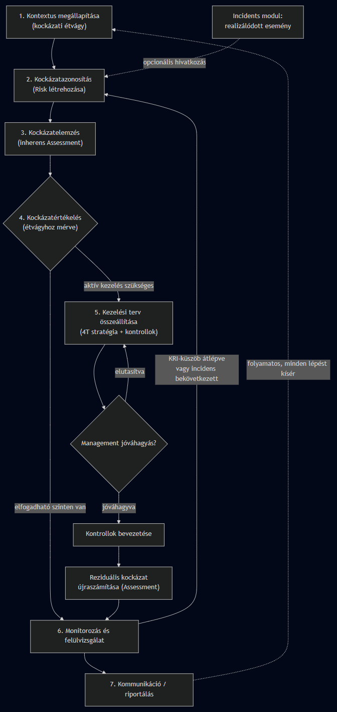
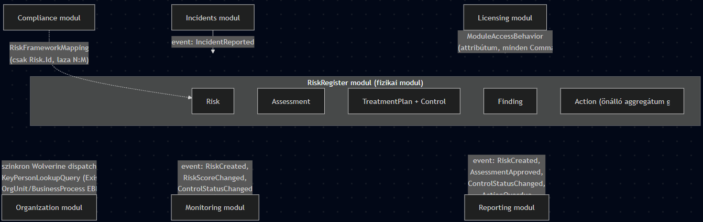
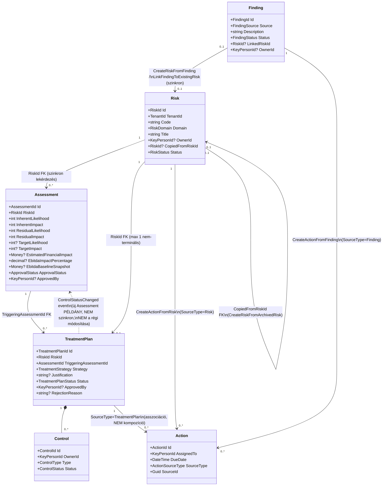
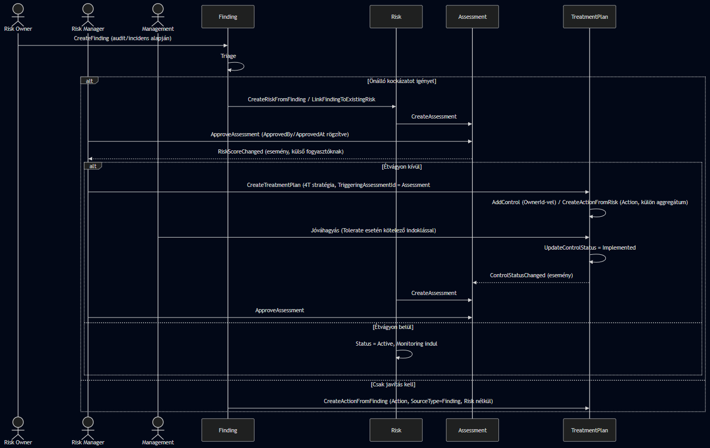

# RiskRegister modul – Tervezési napló

> **Cél:** ez a dokumentum a `RiskRegister` modul tervezését vezeti végig öt lépcsőn,
> "vízesés-mélységben" — csak akkor lépünk a következő lépcsőre, ha az előzőn megegyeztünk.
> Amikor ez a dokumentum lezárul, a NIS2/Compliance modell tervezése egy hasonló, külön
> dokumentumban (`docs/design/nis2-design.md`) folytatódik, az ADR-016-ban lefektetett
> Compliance Framework Catalog architektúrára építve.
>
> ⚠️ **Javítva (2026-09-03):** az 1. lépcső lezárása után, a 2. lépcső elején tisztázódott
> (lásd `docs/SPEC.md` §4.1 megjegyzés), hogy `Assessment` és `Treatment` **nem külön fizikai
> modul**, hanem a `RiskRegister` modulon belüli, önálló aggregátum gyökér (`Risk`,
> `Assessment`, `TreatmentPlan`). Ennek oka: a licencelési granularitás (`[RequiresModule]`
> attribútum) nem követeli meg a fizikai modul-szétválasztást — az attribútum reflexióval,
> a fizikai kódelrendezéstől függetlenül olvasható. A `ModuleType` enum licencelési célra
> továbbra is három külön értéket tart fenn (`RiskRegister`, `Assessment`, `Treatment`), de
> ez már csak a licencelést, nem a kód/DbContext-szervezést érinti. Az ez alatti szöveg egy
> része (1.5, 1.9, 1.15 fejezet) még a korábbi, "külön modulok event-eken keresztül"
> feltételezésre épült — a releváns pontokon jelezve, korrigálva.
>
> **Kapcsolódó story-k:** `story/1.1-risk-aggregate`, `story/1.2-risk-commands`,
> `story/1.3-risk-queries` (lásd `docs/TASKS.md`, EPIC 1).
> **Kapcsolódó ADR-ek:** ADR-016 (Compliance Framework Catalog) — a `Risk` aggregate
> tudatosan framework-agnosztikus marad, semmilyen NIS2-specifikus mezőt nem kap.
>
> **Létrehozva:** 2026-09-02. Ez a fájl folyamatosan bővül, ahogy a beszélgetés halad.

---

## Állapot

| Lépcső | Témakör | Státusz |
|---|---|---|
| 1 | Domén-elmélet (fogalmak, szabályok, kód nélkül) | ✅ lezárva (2026-09-03) — nyitott kérdések (1.16) megválaszolva |
| 2 | Koncepcionális modell (aggregátok, VO-k, eventek, állapotátmenetek) | ✅ lezárva (2026-09-05, kiegészítve 2026-09-06) — kritikai review lefutott, minden blokkoló pont javítva; a §2.8-ban maradt 3 tétel a 3. lépcső napirendjén dől el, nem előfeltétele |
| 3 | API / slice terv (Command-ok, Query-k, validáció, végpontok) | ✅ lezárva (2026-09-06) — `Risk` (3.1), `Finding` (3.2), `Assessment` (3.3), `TreatmentPlan`+`Control`+`Action` (3.4), jogosultsági modell (3.5) kész; két tudatosan nyitva hagyott, nem blokkoló technikai adósság (§2.8) |
| 4 | Implementáció | ⏳ nincs elkezdve |
| 5 | Ellenőrzés (teszterv, megfelelés-ellenőrzés a 2. lépcsőnek) | ⏳ nincs elkezdve |

---

## 1. lépcső – Domén-elmélet

> Ide kerül minden fogalmi tisztázás, mielőtt bármilyen adatszerkezetről beszélnénk.
> Cél: közös, pontos szótár és szabályrendszer a Risk/Assessment/Treatment hármasról.
> Az alapokat az iparágban elterjedt keretrendszerek (ISO 31000, COSO ERM, valamint a
> kvantitatív oldalon a FAIR – Factor Analysis of Information Risk) adják, de nem követünk
> egyiket sem szolgaian — a REZILIO a gyakorlatban hasznos, versenyképes részhalmazt
> implementálja, tudatosan reagálva a piacon látható GRC-eszközök gyengeségeire (ld. 1.14).

### 1.1 Mi a kockázat?

A **kockázat** egy bizonytalan jövőbeli esemény vagy körülmény hatása a szervezet céljaira.
A definícióban három dolog fontos:

- **Bizonytalanság** — a kockázat még nem következett be, csak valószínűsíthető. Ez különbözteti
  meg élesen az **incidenstől**: az incidens egy már bekövetkezett esemény (a kockázat
  "realizálódott"), a kockázat pedig a jövőre vonatkozó, még nyitott lehetőség. A REZILIO-ban ez
  két külön modul (`RiskRegister` vs. `Incidents`), amelyek között tudatos, de nem kötelező
  kapcsolat lehet (egy incidens hivatkozhat arra a kockázatra, ami "bejött").
- **Hatás a célokra** — a kockázatnak mindig kontextusa van: mihez képest kockázat? Egy
  szervezeti célhoz, egy üzleti folyamathoz, egy eszközhöz (IT rendszer, adat, létesítmény)
  képest. Enélkül a kockázat megfogalmazása üres ("adatszivárgás" önmagában nem kockázat,
  hanem "adatszivárgás az ügyfél-nyilvántartó rendszerből, ami bizalomvesztéshez és GDPR
  bírsághoz vezet" — az már az).
- **Kétirányúság (elméletben)** — a klasszikus definíció (ISO 31000) szerint a kockázat lehet
  pozitív (lehetőség) vagy negatív (fenyegetés) eltérés a várttól. A gyakorlati vállalati
  kockázatkezelés (és a REZILIO is) túlnyomórészt a **negatív** oldalra fókuszál — tehát
  "kockázat" a mi rendszerünkben gyakorlatilag mindig fenyegetést jelent, nem lehetőséget.

### 1.2 A kockázat felépítő elemei

Egy jól megfogalmazott kockázatnak van egy belső anatómiája — ezek azok a fogalmak, amik
később a `Risk` aggregate mezőiként jelennek majd meg (de ez még a 2. lépcső, itt csak a
fogalmat tisztázzuk):

- **Forrás / ok (cause)** — mi idézheti elő a kockázatot? Pl. elavult szoftverkomponens,
  egyszemélyes függőség egy kulcsemberen, hiányzó backup-folyamat, egy kritikus beszállító
  (`Supplier`) instabilitása.
- **Kockázati esemény (risk event)** — mi történne, ha a kockázat realizálódna? Pl.
  "a fő ügyfélszolgálati rendszer 4 óránál tovább nem elérhető".
- **Hatás / következmény (impact/consequence)** — mi lenne az esemény üzleti következménye?
  Pénzügyi veszteség, hírnévkár, jogi/megfelelőségi szankció, működési fennakadás. Egy
  kockázatnak több hatásdimenziója is lehet egyszerre (pl. egyszerre pénzügyi ÉS hírnévkár) —
  ez a **többdimenziós hatás (multi-dimensional impact)** fogalma, amit sok egyszerűbb eszköz
  figyelmen kívül hagy egyetlen összevont "hatás" mezővel, holott vezetői döntéshozatalhoz
  éppen a dimenziók szétválasztása ad valódi értéket.
- **Valószínűség (likelihood/probability)** — mekkora eséllyel következik be egy adott
  időtávon belül. Gyakorlatban ez ritkán pontos statisztikai valószínűség, inkább egy
  kvalitatív skála (pl. 1–5: "elhanyagolható" … "szinte biztos") — de lásd 1.4, ahol a
  kvantitatív alternatívát is tárgyaljuk.
- **Hatásmérték (impact/severity)** — ha bekövetkezik, mekkora a kár mértéke. Szintén
  gyakran kvalitatív skála (1–5: "elhanyagolható" … "katasztrofális"), de versenyképes
  megoldásban célszerű a pénzügyi hatás becslését is lehetővé tenni (`Money` value object,
  ADR-006 szerint) legalább opcionálisan.
- **Kitettség/kockázati szint (risk level/exposure)** — a valószínűség és a hatásmérték
  szorzata vagy kombinációja (lásd 1.4 – kockázati mátrix). Ez adja a kockázat rangsorolási
  alapját.
- **Kockázati sebesség (risk velocity)** — modern kockázatkezelési szakirodalomban egyre
  hangsúlyosabb fogalom: nem csak az számít, *mekkora* a kockázat, hanem az is, *milyen
  gyorsan* csap le, ha bekövetkezik (pl. egy ransomware-esemény óránként terjed, egy
  reputációs kockázat hetek alatt bontakozik ki). A gyors lecsapású, magas hatású kockázatok
  más kezelési prioritást igényelnek, mint a lassan kibontakozók, még ha az "elméleti"
  kockázati szintjük azonos is. *(v1 scope kérdés — ld. nyitott kérdések)*
- **Kockázati összefüggések (risk interdependency / correlation)** — kockázatok a
  valóságban ritkán elszigeteltek: egy kritikus beszállító kiesése egyszerre több
  `BusinessProcess`-t és `ItSystem`-et is érinthet, és egy technológiai kockázat
  (pl. elavult rendszer) áttételesen megfelelőségi kockázattá válhat (NIS2-sértés). A
  legtöbb piaci eszköz ezt nem kezeli — a kockázatok izolált sorokként élnek egy táblázatban.
  Ez egy tudatos differenciációs lehetőség a REZILIO-nak (ld. 1.15).
- **Tulajdonos (risk owner)** — az a személy, aki felelős a kockázat kezeléséért és
  nyomon követéséért. A REZILIO-ban ez egy `KeyPerson`-re mutató hivatkozás lesz.
- **Domain/kategória** — melyik kockázati területhez tartozik (IT, pénzügyi, operacionális,
  megfelelőségi, ESG, stratégiai, hírnév, harmadik fél/beszállítói stb.) — erről még
  döntenünk kell (ld. nyitott kérdés a fejezet végén).
- **Státusz** — a kockázat életciklusának hol tart (azonosított → elemzés alatt → aktívan
  kezelt → monitorozott → lezárt/archivált). Ez a `Risk` aggregate állapotgépe lesz.

### 1.3 Inherens vs. reziduális kockázat

Ez az egyik legfontosabb, gyakran félreértett fogalompár:

- **Inherens kockázat (inherent risk)** — a kockázat szintje, ha *semmilyen kontroll vagy
  kezelési intézkedés nincs érvényben*. Ez a "nyers", elméleti kockázat.
- **Reziduális kockázat (residual risk)** — a kockázat szintje *a meglévő kontrollok/kezelési
  intézkedések figyelembevétele után*. Ez az, ami ténylegesen fennmarad, és amivel a
  szervezetnek "együtt kell élnie".

Fontos, hogy mindkettőt egyszerre kell tudni ábrázolni és összehasonlítani — enélkül nem
lehet érdemben megítélni, hogy egy adott kontroll mennyit ér ("mennyivel csökkentette a
kockázatot"). Ez közvetlenül a leendő `Assessment` modul feladata lesz: egy kockázathoz
több értékelés is tartozhat időben, és minden értékelésnek van inherens és reziduális
komponense. Érdemes egy harmadik, opcionális állapotot is megfontolni a szakirodalomban
egyre gyakoribb **cél-kockázat (target risk)** formájában — az a szint, amit a kezelési terv
*jövőbeli* (még nem teljesen implementált) intézkedései mellett várunk. Ez teszi lehetővé,
hogy egy kockázat kezelési tervének előrehaladását ("hol tartunk a reziduálistól a
cél-szintig") mérni és riportolni lehessen, nem csak egy statikus pillanatképet mutatni.

### 1.4 Kockázat számszerűsítése: kvalitatív mátrix vs. kvantitatív modellek

A valószínűség × hatásmérték kombinációját tipikusan egy **kockázati mátrixban** (leggyakrabban
5×5-ös hőtérképben) ábrázolják: zöld (alacsony) → sárga (közepes) → narancs (jelentős) →
piros (kritikus) zónák. Ez a legelterjedtebb, legkönnyebben kommunikálható módszer, és a
frontend tervben (Story 1.8 – Assessment UI) is ez szerepel Recharts-alapú hőtérképként.

Fontos azonban ismerni a **kvalitatív mátrix jól dokumentált gyengeségeit** is, amikről a
kockázatkezelési szakirodalom (pl. Douglas Hubbard: *The Failure of Risk Management*) sokat
ír, és amik miatt a modern, érettebb eszközök egyre inkább kiegészítő kvantitatív réteget
is kínálnak:

- **Ál-pontosság (false precision)** — egy 1–5 skálán "3×4=12" szorzás azt a látszatot
  kelti, hogy pontos számítás történt, holott két szubjektív becslés szorzatáról van szó.
- **Skála-kompresszió** — az 5×5-ös mátrix nem tud különbséget tenni egy 10 000 EUR-s és
  egy 10 millió EUR-s "katasztrofális" hatás között, pedig üzletileg ez óriási különbség.
- **Rangsorolási ütközések** — sok kockázat végül ugyanabba a "piros" cellába kerül, ami
  nem segít eldönteni, melyikkel kell *elsőként* foglalkozni.

A **kvantitatív modellek** (ezek közül a legelterjedtebb, iparági szabvánnyá vált módszertan
a **FAIR — Factor Analysis of Information Risk**) ehelyett a kockázatot valószínűségi
eloszlásokkal és várható pénzügyi veszteség-tartományokkal (pl. "évi várható veszteség"
— Annualized Loss Expectancy) fejezik ki. Ez pontosabb és jobban összevethető az üzleti
döntéshozatallal (pl. egy biztonsági beruházás ROI-jával), de nagyobb szakértelmet és
adatérettséget igényel a bevezetéshez.

**Döntés erre a lépcsőre:** a REZILIO v1-ben a kvalitatív mátrix marad az elsődleges,
kötelező módszer (egyszerű, gyorsan bevezethető, a célközönség — kkv/középvállalati piac —
számára ismerős), de a `Risk`/`Assessment` modellt úgy tervezzük, hogy egy **opcionális,
később bekapcsolható kvantitatív mező-csoport** (várható pénzügyi veszteség-tartomány,
`Money` alapú) ne igényeljen újratervezést, csak bővítést — ez versenyelőnyt jelenthet a
tisztán kvalitatív versenytársakkal szemben anélkül, hogy az MVP-t bonyolítanánk.

A mátrix cellái mögött üzleti szabály áll: mely kombinációk számítanak "elfogadhatónak" a
szervezet **kockázati étvágya (risk appetite)** szerint — ez egy tenant-szintű beállítás
lesz (mennyi kockázatot hajlandó a szervezet vezetése tudatosan vállalni), és ebből
származtatható a **kockázati tolerancia (risk tolerance)** — az a sáv, ami még belefér az
étvágyba, de figyelmet igényel.

### 1.5 A kockázatkezelési folyamat (ISO 31000 alapján, egyszerűsítve)

1. **Kontextus megállapítása** — mihez képest értékelünk (szervezeti célok, érintett
   folyamatok/rendszerek/eszközök). A REZILIO-ban ezt jórészt már az Organization modul
   adja (OrganizationalUnit, ItSystem, BusinessProcess, KeyPerson, Supplier) — a kockázatok
   ezekre hivatkoznak majd.
2. **Kockázatazonosítás** — a kockázat felvétele a regiszterbe (`Risk` létrehozása).
3. **Kockázatelemzés** — az ok, esemény, hatás, valószínűség/hatásmérték számszerűsítése
   (ez lesz az `Assessment` modul).
4. **Kockázatértékelés** — a kapott szint összevetése a kockázati étvággyal/toleranciával,
   rangsorolás, prioritizálás.
5. **Kockázatkezelés (treatment)** — döntés és intézkedés arról, mit teszünk a kockázattal
   (ld. 1.10 — a "4T" stratégiák).
6. **Monitorozás és felülvizsgálat** — a kockázat és a kontrollok *folyamatos* (nem csak
   időszakos) újraértékelése, KRI-k (ld. 1.11) figyelése (ez lesz a `Monitoring` modul,
   EPIC 2) — a folytonosság fontosságát az 1.10 fejezet külön kiemeli, mint modern trendet.
7. **Kommunikáció és konzultáció** — a folyamat minden lépésében jelen van (riportok,
   dashboardok — `Reporting` modul, EPIC 3), nem külön lépés, hanem áthatja az egészet.

Ez a hét lépés adja a modul-/aggregátumhatárok gerincét: a `RiskRegister` fizikai modulon
belül a `Risk` aggregátum (1–2), az `Assessment` aggregátum (3–4) és a `TreatmentPlan`
aggregátum (5) felel, míg a `Monitoring` (6) és a `Reporting` (7) továbbra is önálló,
külön fizikai modul marad. *(Javítva 2026-09-03: eredetileg itt `RiskRegister`/`Assessment`/
`Treatment` mint három külön modul szerepelt — a tényleges döntés az egy fizikai modul,
három aggregátum felépítés, lásd a dokumentum tetején lévő megjegyzést.)*

### 1.6 Szereplők (aktorok) a folyamatban

A folyamat csak akkor működik, ha tudjuk, *ki* csinálja. Ezek egyelőre üzleti szerepek —
azt, hogy pontosan mely Keycloak realm role-okra képződnek le (ADR-012), tudatosan a
2./3. lépcsőre hagyjuk (ld. nyitott kérdés a fejezet végén):

- **Risk Owner (kockázat tulajdonosa)** — a `KeyPerson`, aki napi szinten felelős egy adott
  kockázatért: nyomon követi, javaslatot tesz kezelési stratégiára, frissíti a státuszt.
- **Risk Manager / CISO (kockázatkezelési felelős)** — felügyeli a teljes regisztert,
  jóváhagyja/felülbírálja az egyedi értékeléseket, meghatározza és karbantartja a
  kockázati étvágyat, priorizál a regiszter szintjén.
- **Vezetőség / Management (döntéshozó, jóváhagyó)** — elfogadja a kockázati étvágyat mint
  irányelvet, formálisan jóváhagyja a magas kockázatú tételek "elfogadás" (Accept)
  stratégiáját, illetve a jelentős beruházást igénylő kezelési terveket.
- **Control Owner (kontroll-felelős)** — felelős egy konkrét kontroll bevezetéséért és
  működtetéséért; nem feltétlenül azonos a Risk Ownerrel (pl. egy IT-kockázat kontrollját
  az üzemeltetési csapatvezető viszi).
- **Auditor / Compliance-felelős** — belső vagy külső fél, aki visszamenőleg ellenőrzi a
  folyamatot és bizonyítékot keres — ő az elsődleges "fogyasztója" a `Reporting` modulnak,
  és az ő igénye köti majd össze ezt a modult a Compliance/NIS2 réteggel.
- **Tenant Admin** — a Licensing-szintű modulaktiválást és jogosultságkezelést végzi, nem
  vesz részt az üzleti folyamatban magában.
- **Érintett üzletágvezető (olvasó szerepkör)** — csak a rá vonatkozó (pl. saját
  `OrganizationalUnit`-hoz vagy `BusinessProcess`-hez kötött) kockázatokat látja, jellemzően
  csak olvasási joggal.

### 1.7 Folyamatlépésenkénti bemenet, dokumentum és termék

Az 1.5-ös hét lépéshez most hozzárendeljük, hogy adott lépésben ki a fő szereplő, mi megy
be, és mi a konkrét "termék" (dokumentum/rekord), ami kijön belőle:

| # | Folyamatlépés | Fő szereplő(k) | Bemenet | Kimenet / termék |
|---|---|---|---|---|
| 1 | Kontextus megállapítása | Risk Manager, Management | Szervezeti célok; `OrganizationalUnit`/`ItSystem`/`BusinessProcess`/`Supplier` leltár (Organization modul); kockázati étvágy irányelv | Rögzített kockázati étvágy/tolerancia (tenant-szintű beállítás) |
| 2 | Kockázatazonosítás | Risk Owner (bárki jelezheti) | Workshop, incidens-tapasztalat, audit-megállapítás, fenyegetés-információ, KRI-riasztás | Új `Risk` bejegyzés a regiszterben (kezdeti, "azonosított" státuszban) |
| 3 | Kockázatelemzés | Risk Owner + szakértő | Risk leírása, historikus adat, szakértői becslés | `Assessment` rekord (inherens valószínűség × hatás) |
| 4 | Kockázatértékelés | Risk Manager | Assessment eredménye, kockázati étvágy | Rangsorolt/prioritizált kockázat, döntés: kell-e aktív kezelés |
| 5 | Kockázatkezelés (treatment) | Risk Owner, Control Owner, Management (jóváhagyás) | Kiválasztott stratégia (4T), elérhető erőforrás/büdzsé | Kezelési terv (kontrollok, akciók, felelősök, határidők) |
| 6 | Monitorozás és felülvizsgálat | Risk Owner, Control Owner, rendszer (automatizált) | KRI-adatfolyamok, kontroll-tesztelési eredmény, incidensek | Frissített reziduális kockázat, KRI-riasztás, felülvizsgálati bejegyzés |
| 7 | Kommunikáció / riportálás | Risk Manager, Management, Auditor | A regiszter aktuális, teljes állapota | Vezetői jelentés, audit-bizonyíték, dashboard |

### 1.8 A kockázatkezelési életciklus — folyamatábra

A fenti hét lépés a valóságban nem lineáris, hanem **ciklikus**, visszacsatolásokkal: egy
KRI-riasztás vagy egy bekövetkezett incidens újraindíthatja az azonosítást/elemzést, és a
kezelési terv jóváhagyása is elbukhat, ami visszaküldi a tervet átdolgozásra.

> ℹ️ **Ha a lenti diagram nem jelenik meg a szerkesztődben:** a VS Code beépített Markdown
> előnézete alapból nem tud Mermaid-et renderelni. Telepítsd a **"Markdown Preview Mermaid
> Support"** kiterjesztést (kiadó: `bierner`, azonosító: `bierner.markdown-mermaid`), utána
> a `Ctrl+Shift+V` (Markdown előnézet) már megjeleníti. Alternatívaként a fájl GitHub/GitLab
> felületén natívan renderelődik, feltöltés/push után. A diagram utáni bekezdés a folyamatot
> szövegesen is leírja, ha egyik sem elérhető.

**A diagram szövegesen:** a kontextus megállapítása (1) után a kockázat azonosítása (2),
majd elemzése (3) következik. Az értékelés (4) elágazás: ha a kockázat az étvágyon belül
van, egyenesen a monitorozásba (6) kerül; ha nem, kezelési terv készül (5), amit a
vezetőségnek jóvá kell hagynia — elutasítás esetén a terv visszakerül átdolgozásra,
jóváhagyás esetén a kontrollok bevezetésre kerülnek, és a reziduális kockázatot újra kell
számítani (ismét Assessment), ami a monitorozásba (6) fut be. A monitorozásból egy
KRI-küszöb átlépése vagy egy bekövetkezett incidens visszaindíthatja a folyamatot az
azonosításig (2) — ez a fő visszacsatolási hurok. A kommunikáció/riportálás (7) a teljes
folyamatot végig kíséri, nem külön, egyszeri lépés. Az Incidents modulból egy realizálódott
esemény opcionálisan új kockázat-azonosítást indíthat.

### 1.9 Modulok/aggregátumok nagyvonalú felelőssége és adatáramlás

Ez a szakasz még mindig üzleti szinten (nem osztály-szinten) rögzíti, melyik modul/aggregátum
miért felel, és milyen adat áramlik köztük — ez lesz a híd a 2. lépcsőhöz, ahol ez konkrét
aggregate-ekre, eseményekre és Command/Query-kre fordítódik le.

> ⚠️ **Javítva (2026-09-03):** ez a szakasz eredetileg `RiskRegister`, `Assessment` és
> `Treatment` felelősségét három külön *modulként* írta le, kizárólag Wolverine domain
> event-eken keresztüli kommunikációval. A tényleges döntés (lásd a dokumentum elején lévő
> megjegyzést és `docs/SPEC.md` §4.1) az, hogy ez a három **egy fizikai `RiskRegister` modul
> három aggregátum gyökere**, közös `DbContext`-tel. Az alábbi felelősség-leírás tartalmilag
> változatlan (ki miért felel), de a "modul" szót "aggregátum"-ra cseréltük ott, ahol
> `Risk`/`Assessment`/`TreatmentPlan`-ról van szó, és a záró bekezdés is ennek megfelelően
> frissült.

- **`Risk` aggregátum (RiskRegister modul)** — a kockázat *azonosítása és alaptörzsadata*
  (cím, leírás, domain, tulajdonos, státusz). Ez az egyetlen hely, amelyik a `Risk`
  azonosítót "kibocsátja" — minden más aggregátum/modul erre az azonosítóra hivatkozik, nem
  duplikálja az alapadatot.
- **`Assessment` aggregátum (RiskRegister modul)** — egy adott `Risk`-hez tartozó, *időben
  ismétlődő* értékelések (inherens/reziduális/cél-szint). Bemenete a `Risk` referencia
  (ugyanabban a `DbContext`-ben, szinkron lekérdezéssel elérhető); kimenete az `Assessment`
  rekord, amit a `TreatmentPlan` (mennyit kell csökkenteni) és a `Reporting` modul
  (trend-elemzés) egyaránt fogyaszt.
- **`TreatmentPlan` aggregátum (RiskRegister modul)** — egy adott kockázathoz (és annak
  legutóbbi értékeléséhez) tartozó kezelési stratégia, kontrollok és akciók. Ahogy egy
  kontroll ténylegesen bevezetésre kerül, ez **visszahat** a következő `Assessment` ciklusra
  (a reziduális kockázat újraszámítását kéri/váltja ki) — ez a legfontosabb visszacsatolási
  pont, és mivel mindhárom aggregátum egy modulban él, ez **belső, szinkron** folyamat lehet,
  nem kell hozzá domain event.
- **`Monitoring`** (EPIC 2, önálló fizikai modul) — a bevezetett kontrollok és KRI-k
  *folyamatos* figyelése. Bemenete a `TreatmentPlan` kontroll-állapota és külső
  adatfolyamok; ez már **modulhatáron átnyúló** adatáramlás, tehát domain eventen keresztül
  történik. Kimenete riasztási esemény, ami új `Assessment`/`Risk` ciklust indíthat
  (visszacsatolás a folyamat elejére, ld. 1.8 ábra).
- **`Incidents`** (EPIC 2, önálló fizikai modul) — a *már bekövetkezett* események
  rögzítése, opcionális hivatkozással egy `Risk`-re ("ez a kockázat realizálódott"). Ez
  indíthat új kockázat-azonosítást is (ha egy incidens korábban nem ismert kockázatot tár
  fel) — modulhatáron átnyúló, tehát event-alapú kapcsolat.
- **`Reporting`** (EPIC 3, önálló fizikai modul) — kizárólag *olvassa* a `RiskRegister`,
  `Monitoring`, `Incidents` adatait, nem ír vissza; vezetői összefoglalókat és
  audit-bizonyítékot állít elő. Modulhatáron átnyúló, event-alapú kapcsolat.
- **`Compliance`** (később, ADR-016, önálló fizikai modul) — a `Risk`-re opcionális, N:M
  `RiskFrameworkMapping`-gel kapcsolódik; nem része a fenti láncnak, csak "rácsatlakozik".
  Ez a kapcsolat is modulhatáron átnyúló, de mivel csak `Risk.Id`-t igényel, a modul-egyesítés
  döntése nem befolyásolja.

**Fontos architekturális korlát, amit ez a láncolat implikál:** mivel a REZILIO moduláris
monolit (ADR-001), a **fizikai modulhatárokon átnyúló** adatáramlás (pl. `RiskRegister` ↔
`Monitoring`, `RiskRegister` ↔ `Incidents`, `RiskRegister` ↔ `Compliance`) nem jelenthet
közvetlen adatbázis-JOIN-t egy másik modul tábláira — ez Wolverine domain eventeken keresztül
történik (ADR-002), ahogy ezt már az Organization/Licensing modulpár is követi. A
`RiskRegister` modulon **belüli** `Risk`↔`Assessment`↔`TreatmentPlan` adatáramlás ezzel
szemben ugyanazon `DbContext`-en belüli, szinkron lekérdezés — ehhez nem szükséges event
(bár egy `RiskScoreChanged`-szerű event továbbra is hasznos lehet a *külső* fogyasztók,
Monitoring/Reporting felé, lásd `docs/SPEC.md` §4.3). Ezt a 2./3. lépcsőben konkrét
esemény-lista formájában kell majd kidolgozni a ténylegesen modulhatáron átnyúló
kapcsolatokra (pl. `RiskCreated`, `RiskScoreChanged`, `ControlStatusChanged` → Monitoring/
Reporting; `IncidentReported` → RiskRegister).

### 1.10 Kockázatkezelési stratégiák (a "4T")

Amikor egy kockázatot kezelni kell, alapvetően négy stratégia közül lehet választani:

- **Mérséklés / csökkentés (Treat/Mitigate)** — kontrollok bevezetése, amik csökkentik a
  valószínűséget és/vagy a hatásmértéket (pl. redundáns rendszer, képzés, MFA bevezetése).
- **Áthárítás (Transfer)** — a kockázat pénzügyi következményének áthárítása másra, pl.
  biztosítás kötése, alvállalkozóra hárítás szerződésben.
- **Elfogadás / tolerálás (Tolerate/Accept)** — tudatos döntés, hogy a kockázatot a
  szervezet vállalja, mert a kezelés költsége meghaladná a hasznot, vagy a kockázati
  étvágyon belül van. Ezt is dokumentálni kell (ki, mikor, miért fogadta el) — ez tipikusan
  auditálási szempontból az egyik legkritikusabb adat, amit egy naplózatlan Excel-alapú
  megoldás gyakran elveszít.
- **Megszüntetés / elkerülés (Terminate/Avoid)** — a kockázatot okozó tevékenység/rendszer/
  folyamat megszüntetése (pl. egy elavult, sebezhető rendszer teljes kivezetése).

Minden stratégiához tartozhatnak konkrét **kontrollok** és **akciók** — ez lesz a
`Treatment` modul tartalma.

### 1.11 Kontrollok, KRI-k és a folyamatos kontroll-monitorozás trendje

- **Kontroll (control)** — egy konkrét intézkedés vagy mechanizmus, ami a kockázatot
  kezeli. Típusai: **megelőző (preventive)** — megakadályozza a bekövetkezést (pl. tűzfal),
  **felderítő (detective)** — észleli, ha bekövetkezik (pl. monitoring riasztás),
  **korrekciós (corrective)** — helyreállít, ha bekövetkezett (pl. disaster recovery terv).
- **Kontroll-tesztelés modellje** — hagyományosan a kontrollok hatékonyságát *pontban az
  időben* (pl. évi audit során, mintavétellel) ellenőrzik. Ez az ún. **pontszerű
  ellenőrzés (point-in-time testing)**. A modern irány ezzel szemben a **folyamatos
  kontroll-monitorozás (Continuous Controls Monitoring, CCM)**: automatizált, gyakori
  (akár napi) ellenőrzés arról, hogy egy kontroll ténylegesen működik-e — pl. egy MFA-
  szabály tényleg minden fiókra érvényben van-e, nem csak papíron. A REZILIO-ban ez a
  `Monitoring` modul egyik hosszabb távú célja lehet, a KRI-khez hasonló
  küszöbérték-riasztási mechanizmuson keresztül.
- **KRI (Key Risk Indicator)** — egy mérhető mutató, ami előre jelzi a kockázati szint
  változását (pl. "sikertelen bejelentkezési kísérletek száma/nap", "lejárt szoftverfrissítések
  száma"). Fontos megkülönböztetni a **KPI-tól (Key Performance Indicator)**: a KPI a
  teljesítményt méri ("hány ticket lett lezárva"), a KRI a *kockázat* előjeleit méri. A
  KRI-khez tipikusan **küszöbérték (threshold)** tartozik, aminek átlépése riasztást vált ki
  — ez lesz a `Monitoring` modul központi eleme.

### 1.12 A kockázati regiszter mint eszköz

A **kockázati regiszter (risk register)** maga a strukturált nyilvántartás, ami az összes
azonosított kockázatot, azok aktuális állapotát, tulajdonosát, értékelését és kezelési
tervét tartalmazza egy helyen. Ez nem csak egy Excel-tábla digitális megfelelője — a
regiszter az, ami lehetővé teszi a **rangsorolást** (mely kockázatokkal kell most
foglalkozni), a **nyomon követést** (ki miért felelős, mi a határidő) és a **riportálást**
(vezetői összefoglalók, audit-bizonyíték). Ez indokolja, hogy a `RiskRegister` legyen a
legelső épülő modul (EPIC 1) — minden más erre épül rá.

### 1.13 Harmadik fél / beszállítói kockázat (Third-Party Risk Management)

Külön említést érdemel, mert 2024–2026 óta az egyik leggyorsabban erősödő terület: a
kockázatok jelentős része már nem a szervezeten belülről, hanem **beszállítókon, IT-
szolgáltatókon, alvállalkozókon** keresztül éri el a céget (ellátási lánc-kockázat). A
NIS2 irányelv maga is kifejezetten előírja a **beszállítói lánc biztonságának** kezelését
(Article 21(2)(d)). A REZILIO-ban erre már van egy natúr kapcsolódási pont: az Organization
modul `Supplier` entitása, valamint a `CriticalityLevel` besorolás. A `Risk` aggregate
tervezésekor érdemes lesz tudatosan eldönteni, hogy a beszállítói kockázat egy **külön
domain/kategória**-e a többi kockázat között, vagy egy **külön, `Supplier`-re mutató
opcionális referenciamező** a `Risk`-en (ez utóbbi valószínűbb, mert a domain-kategorizálás
mellett is szükség lehet arra, hogy egy IT-kockázat *egyben* beszállítói eredetű is legyen).

### 1.14 Piaci kontextus — a jelenlegi GRC-eszközök erősségei és gyengeségei

Mielőtt lefixáljuk a modellt, érdemes tudatosan reflektálni arra, mit csinálnak jól/rosszul
a piacon elérhető megoldások, hogy a REZILIO ne ismételje meg ugyanazokat a hibákat:

**Tipikus gyengeségek a piacon:**

- **Excel/SharePoint-alapú "kockázati regiszterek"** — a legelterjedtebb valóság a kkv-
  szegmensben (amit a REZILIO elsődlegesen céloz). Nincs verziózás, nincs jogosultságkezelés
  sor-szinten, nincs audit trail, nincs automatikus riasztás — mindez pontosan az, amit egy
  API-first, moduláris SaaS platform triviálisan megold.
- **Nehézsúlyú, monolitikus GRC-suite-ok** (pl. RSA Archer, ServiceNow GRC, MetricStream) —
  rendkívül erősek funkcionalitásban, de hírhedten **lassúak bevezetni** (gyakran hónapok),
  **drágák**, és **túlkomplexek** egy közepes méretű szervezet számára. Gyakran egy
  külön tanácsadói projekt kell csak a konfigurációjukhoz.
- **Statikus, periodikus értékelési ciklus** — sok eszköz negyedéves/éves "kockázatfelmérési
  kampányokban" gondolkodik, ahelyett hogy a kockázati szintet folyamatosan frissítené élő
  jelek (KRI-k, incidensek, sebezhetőség-adatok) alapján.
- **Framework-szigetek** — ha egy szervezetnek egyszerre kell megfelelnie NIS2-nek, ISO
  27001-nek és DORA-nak, sok eszközben ez három külön, egymással nem beszélő modul/tábla,
  ami többszörös adminisztrációs terhet jelent ugyanarra a kontrollra. *(Ez pontosan az
  a probléma, amit az ADR-016 Compliance Framework Catalog architektúrája tudatosan
  megold — a mapping N:M és verziózott.)*
- **Gyenge UX, elavult frontend** — a kategória nagy szereplői gyakran 10+ éves admin-felület
  esztétikával dolgoznak, ami rontja az elfogadottságot a nem biztonsági szakértő
  felhasználók (pl. üzletágvezetők) körében.
- **API-másodlagosság** — sok GRC-eszköznél az API utólagos ráépítés, nem elsődleges
  tervezési elv, ami megnehezíti az integrációt más rendszerekkel (ticketing, CMDB,
  sebezhetőség-kezelés). A REZILIO API-first elve (ADR-005) itt eleve előnyt ad.

**Modern trendek, amikre érdemes figyelni:**

- **Continuous Controls Monitoring (CCM)** — ld. 1.11.
- **Kvantitatív kockázatelemzés (FAIR és hasonló modellek)** terjedése a tisztán
  kvalitatív mátrixok mellett/helyett — ld. 1.4.
- **AI-asszisztált kockázatazonosítás és -megfogalmazás** — pl. dokumentumokból
  (szerződések, incidens-jegyzőkönyvek, biztonsági jelentések) automatikus kockázat-javaslat
  generálása, vagy egy KRI-riasztásból automatikus, emberi nyelvű összefoglaló készítése.
  Ez pontosan illeszkedik a már betervezett `AIInsights` modulhoz (EPIC 4) — érdemes lesz
  ott erre koncepcionálisan visszautalni.
- **Beszállítói/harmadik fél kockázat konvergenciája** az általános kockázatkezeléssel
  (nem külön "TPRM eszköz", hanem integrált nézet) — ld. 1.13.
- **ESG- és kiberkockázat konvergenciája** — a szabályozói nyomás (pl. CSRD, NIS2) miatt
  ezek egyre inkább ugyanazon a kockázati regiszteren és riportáláson osztoznak, nem külön
  eszközben élnek.
- **No-code/low-code framework-mapping** — a compliance-keretrendszerek közötti
  megfeleltetés (pl. "az ISO 27001 A.5.1 kontroll lefedi a NIS2 21(2)(a) követelményt")
  egyre inkább vizuális, önkiszolgáló admin-eszközökkel történik, nem fejlesztői
  beavatkozással — ez hosszabb távon hatással lesz a Compliance modul UI tervére is.

### 1.15 REZILIO differenciációs pontok (összegzés erre a modulra)

A fentiek alapján a `RiskRegister` modulnak (három aggregátumával: `Risk`, `Assessment`,
`TreatmentPlan`) és a rá épülő `Monitoring` modulnak *(korábban itt tévesen "RiskRegister/
Assessment/Treatment/Monitoring trió (négyes)" szerepelt, mintha mind a négy külön modul
lenne — javítva 2026-09-03)* már a jelenlegi architektúra-döntéseink is versenyelőnyt adnak,
és van néhány tudatos
irány, amit érdemes a roadmapban (nem feltétlenül v1-ben) tartani:

- **Már megalapozott előny:** moduláris, licenc-alapú aktiválás (nem kell mindent
  megvenni/bevezetni egyszerre) — szemben a monolitikus suite-okkal.
- **Már megalapozott előny:** verziózott, N:M compliance-framework mapping (ADR-016) —
  szemben a framework-szigetekkel.
- **Már megalapozott előny:** API-first (ADR-005), modern frontend (Next.js) — szemben a
  elavult UX-ű piaci szereplőkkel.
- **Roadmap-lehetőség:** opcionális kvantitatív (FAIR-szerű) kockázatbecslés a kvalitatív
  mátrix mellett (ld. 1.4) — ne zárjuk ki a `Risk`/`Assessment` modellből már most.
- **Roadmap-lehetőség:** Continuous Controls Monitoring a `Monitoring` modulban (ld. 1.11).
- **Roadmap-lehetőség:** kockázati összefüggések/korreláció modellezése (ld. 1.2) —
  valószínűleg *nem* v1 scope, de a `Risk` aggregate ne zárja ki elvi szinten.
- **Roadmap-lehetőség:** AI-asszisztált kockázatazonosítás/-narratíva az `AIInsights`
  modulban, ami már a TASKS.md-ben is szerepel (EPIC 4).

### 1.16 Nyitott kérdések (a 2. lépcső előtt eldöntendő) — **lezárva, 2026-09-03**

> Mind a 10 kérdés megbeszélésre és eldöntésre került. Az alábbi lista minden pontnál a
> feltett kérdést és a végleges döntést tartalmazza. Ahol a döntést egy későbbi (2. lépcsős)
> beszélgetés pontosította vagy felülírta, azt külön jelezzük.

1. **Kockázati domének/kategóriák** (IT, pénzügyi, ESG, operacionális, megfelelőségi,
   harmadik fél/beszállítói stb.): fix enum legyen a `Risk`-en, vagy tenant szinten
   bővíthető katalógus (hasonlóan a Compliance Framework Catalog mintájához?
   **DÖNTÉS: fix enum (`RiskDomain`) v1-ben.** A domain-lista üzletileg stabil, nem
   jogszabályváltozás-vezérelt, mint a compliance framework-kontrollok — a bővíthető
   katalógus mintázat itt túlzott komplexitás lenne. Figyelem: a "Compliance" mint
   lehetséges domain-érték névütközésben áll a `Compliance` modul nevével — ezt a 2.
   lépcsőn kell véglegesen elnevezni (pl. `RegulatoryExposure`), lásd `docs/SPEC.md` §4.2
   javítása.
2. **Kockázati étvágy (risk appetite) reprezentációja**: tenant szintű globális beállítás,
   vagy domain/kategória-szintű differenciált érték? **DÖNTÉS: tenant-szintű globális
   beállítás v1-ben.** Egyszerűbb, az MVP célközönségének (kkv/középvállalat) elegendő;
   domain-szintű differenciálás roadmap-tétel, ha ügyféligény indokolja.
3. **Az 1–5 skála** (valószínűség, hatásmérték) fix legyen, vagy konfigurálható (pl. 3 vagy
   5 fokozatú, tenant-preferencia szerint)? **DÖNTÉS: fix 1–5 skála v1-ben.** A
   konfigurálhatóság bonyolítaná a kockázati mátrix UI-t és rontaná az összehasonlíthatóságot
   különböző tenantok/időpontok értékelései között; roadmap-tétel, ha valós igény merül fel.
4. **A `Risk.OwnerId` validációja** `KeyPerson`-re: közvetlen `OrganizationDbContext`
   lekérdezéssel, vagy közvetítő mechanizmussal? **DÖNTÉS: a már bevált mintát követjük**
   (lásd `docs/modules/organization.md` — `OwnerId → KeyPerson` async FK-validáció
   `CreateItSystemValidator`/`CreateBusinessProcessValidator`-ban), de mivel Organization és
   a (most már egyesített) RiskRegister modul **külön fizikai modulok maradnak**, a
   `Risk.OwnerId → KeyPerson` validáció **nem** injektálhatja közvetlenül az
   `OrganizationDbContext`-et (ez sértené az ADR-001 moduláris monolit elvét) — helyette egy
   dedikált, szinkron lookup-mechanizmus szükséges (pl. egy `IKeyPersonLookup` interfész,
   a `Licensing.CheckModuleAccess` mintájához hasonlóan, mint a `CLAUDE.md`-ben rögzített
   második sanctioned kivétel a "nincs közvetlen modulhívás" szabály alól). A pontos
   tervezése a 2. lépcső feladata marad.
5. **Kvantitatív mező-csoport (1.4)**: v1-ben csak "hely legyen hagyva" a jövőbeli
   bővítésre, vagy teljesen kihagyjuk? **DÖNTÉS: hely legyen hagyva** — nullable mezők/külön
   VO már a 2. lépcsős modellben megjelenik, de UI/logika nélkül; a teljes FAIR-alapú
   kvantitatív modell roadmap-tétel.
6. **Beszállítói kockázat (1.9)**: külön domain/kategória, vagy külön `SupplierId`
   referencia mező a `Risk`-en (esetleg mindkettő)? **DÖNTÉS (a 2. lépcső elején pontosítva/
   felülírva):** a `Risk` aggregate **nem** kap semmilyen közvetlen eszköz-/beszállító-
   referencia mezőt — sem `SupplierId`-t, sem egy általánosított
   `RelatedAssetType`/`RelatedAssetId` párost. Ez a beszélgetés két körben derült ki: először
   a `SupplierId` mező tűnt problémásnak (nem minden `RiskDomain`-hez tartozik beszállító),
   majd az általánosított verzió is elutasításra került azon az elven, hogy a `Risk`-nek az
   *összes* `RiskDomain` tiszta, domain-agnosztikus általánosításának kell maradnia — bármilyen
   eszköz-/entitás-referencia mező már domain-specifikus szennyezés lenne rajta. A beszállítói
   kockázat v1-ben kizárólag a `RiskDomain` kategórián keresztül (pl. egy `ThirdParty` érték)
   jelenik meg; ha később tényleges `Supplier`-referencia kell, az egy különálló, laza
   (N:M, a `RiskFrameworkMapping`-hez hasonló) mechanizmus lesz, nem a `Risk` natív mezője.
7. **Kockázati sebesség (risk velocity)** és **kockázati összefüggések (interdependency)**:
   explicit kimaradnak-e a v1 `Risk` modellből? **DÖNTÉS: igen, mindkettő kimarad v1-ből** —
   csak koncepcionálisan dokumentáltak itt (1.2), a Story 1.1 scope-ja kezelhető marad;
   roadmap-tétel.
8. **Cél-kockázat (target risk, 1.3)**: bekerüljön-e már a v1 `Assessment` modellbe az
   inherens/reziduális mellé? **DÖNTÉS: igen, bekerül** — viszonylag alacsony
   többletköltséggel jelentős riportolási értéket ad (kezelési terv előrehaladásának
   mérése a reziduálistól a cél-szintig).
9. **Aktor → Keycloak realm role megfeleltetés (1.6)**: az üzleti szerepek (Risk Owner,
   Risk Manager/CISO, Management, Control Owner, Auditor) pontosan mely Keycloak realm
   role-okra képződjenek le? **LEZÁRVA a 3. lépcsőn (§3.5, 2026-09-06).** A felhasználó
   jogos ellenvetést tett a sima realm role-modellel szemben: *"Nem lenne előnyösebb majd
   Keycloak + ACL?"* — ez megalapozott felvetés volt, és a teljes Command-lista (3.1–3.4)
   megírása után be is igazolódott: több Command jogosultsága eleve rekord-szintű
   összehasonlítást igényelt (pl. `CompleteAction`, `UpdateControlStatus`). **VÉGLEGES
   DÖNTÉS: nem teljes ACL-alrendszer, hanem a meglévő realm role-ok (Admin, RiskManager,
   RiskOwner, Auditor, Executive, Viewer — Story 0.5, nincs új realm role) + egy
   könnyűsúlyú, Command-validátor-szintű rekord-tulajdonos-ellenőrzés** (a bejelentkezett
   `KeyPerson` összevetése a rekord `OwnerId`/`AssignedTo` mezőjével) — lásd §3.5 a teljes
   indoklásért és a "Control Owner" fogalom pontosításáért (nem realm role, hanem
   rekord-szintű megjelölés).
10. **Treatment jóváhagyási munkafolyamat (1.8 ábra)**: legyen-e v1-ben formális,
    rendszerben nyomon követett jóváhagyási lépés, vagy csak dokumentációs szinten marad?
    **DÖNTÉS: v1-ben csak dokumentációs szintű jóváhagyás** (ki hagyta jóvá, mikor —
    egyszerű mezők a `TreatmentPlan`-en), formális workflow-motor nélkül. Felhasználói
    megjegyzés rögzítve: *"el kell majd gondolkodni azon, hogy hova és mikor tesszük be az
    ELSA workflow-t"* — azaz később, ha a jóváhagyási/eszkalációs logika bonyolultabbá válik
    (több lépcsős jóváhagyás, párhuzamos jóváhagyók, timeout-alapú eszkaláció), megfontolandó
    egy dedikált workflow-motor (pl. ELSA) bevezetése. Ennek helye (melyik modul) és
    időzítése (melyik fázis) egyelőre nyitott, roadmap-szintű megfontolás — nem v1 scope.

**Utólagosan felmerült, ezen a listán kívüli, de ugyanide tartozó döntés (2026-09-03):**
a `RiskRegister`/`Assessment`/`Treatment` modulhatár kérdése (lásd a dokumentum tetején lévő
megjegyzés és `docs/SPEC.md` §4.1) — **egy fizikai `RiskRegister` modul, három aggregátum
gyökér**, licencelési szinten továbbra is három külön `ModuleType` enum-értékkel.

---

## 2. lépcső – Koncepcionális modell

> Ha az 1. lépcső a *szótárat* és a szabályokat adta (mi a kockázat, mi az inherens/
> reziduális, milyen szereplők és folyamatlépések vannak — mindez még kód nélkül), akkor
> ez a lépcső azt mondja meg, **konkrétan milyen aggregátumok, mezők, állapotgépek,
> invariánsok és domain eventek** valósítják ezt meg a `RiskRegister` modulban — de **még
> mindig osztály-/kód-szinten, C# nélkül**: itt a "mi legyen benne és milyen szabályt véd"
> a kérdés, a "hogyan hívjuk a mezőt C#-ban, milyen típus legyen pontosan" már a 3. lépcső
> (API/slice terv) feladata. Ez a lépcső azért ilyen mély (minden aggregátumnál cél +
> mezők + invariánsok + a releváns domain eventek), mert ez az utolsó pont, ahol egy rossz
> döntés még olcsón javítható — a 3. lépcsőtől kezdve már konkrét Command/Query/validátor
> kód épül rá.
>
> **Létrehozva:** 2026-09-05, több egyeztetési kör alapján. **Ez a szakasz még nyitott** —
> a szerző (Hatvani Sándor) jelezte, hogy további egyeztetés várható rajta, mielőtt a 3.
> lépcsőre (API/slice terv) lépnénk.

### 2.1 Inherens vs. reziduális kockázat — konkrét példa és döntés

> A fogalom definícióját lásd §1.3 — itt nem ismételjük meg, csak azt rögzítjük, ami
> ténylegesen a 2. lépcsőn dőlt el: egy szemléltető példa, és a Reziduális ≤ Inherens
> invariáns kérdése.

Példa: egy adatszivárgási kockázat inherens hatása = 4 (jelentős), mert nincs védelem. Egy
tűzfal + MFA bevezetése után a reziduális hatás = 2 (közepes) — a kontrollok csökkentették
a tényleges kitettséget, de az inherens érték változatlan marad (az mindig "mi lenne kontroll
nélkül" kérdésre válaszol, függetlenül attól, mi van ténylegesen bevezetve).

**Döntés (megerősítve):** nem lesz kemény invariáns, hogy Reziduális ≤ Inherens — csak UI-
szintű figyelmeztetés, mert bár a gyakorlatban szinte mindig igaz, elméletileg egy kontroll
ronthat is a helyzeten (pl. új támadási felület), és egy hamis kemény szabály hibás
állapotokat blokkolna.

### 2.2 Aggregátumok — cél, mezők, invariánsok, domain eventek

#### `Risk` (aggregate root)

**Cél:** ez a kockázat *azonosságát és alaptörzsadatát* hordozó aggregátum — a
kockázatkezelési folyamat "gerince", amire minden más aggregátum (`Assessment`,
`TreatmentPlan`, `Finding`) hivatkozik. Tudatosan minimális és domain-agnosztikus: nem
tud semmit konkrét eszközökről, beszállítókról vagy pénzügyi számokról — ezek mind más
aggregátumok (`Assessment`) vagy más modulok (Organization) felelőssége.

**Mezők:**
- `Id`, `TenantId`, **`Code`** (**új, a review alapján**: ember-olvasható azonosító, pl.
  `RISK-2026-00042`, a tenanton belül egyedi — konzisztens azzal, hogy minden más
  törzsadat-entitás az Organization modulban is kap `Code`-ot; auditban/riportban
  hivatkozási alap)
- `Domain` (`RiskDomain` enum), `Title`, `Description`
- `OwnerId?` (→ `KeyPerson`, Organization modul, lásd 2.5 — **nullable**, lásd lent)
- `Status` (lásd az alábbi állapotgép-táblázatot)
- **`CopiedFromRiskId?`** (→ `Risk`, önhivatkozó — **új, 2026-09-06**: kitöltve, ha ez a
  `Risk` egy archivált `Risk` másolásával jött létre, lásd lent az `Archived` terminális
  állapottal kapcsolatos pontosítást)

**A `Status` állapotgép — pontos leírás**

> Ez a táblázat feloldja azt az ellentmondást, hogy a §1.2-ben leírt öt fogalmi fázis
> ("azonosított → elemzés alatt → aktívan kezelt → monitorozott → lezárt/archivált") és a
> korábbi vázlat hat névvel ellátott állapota (`Draft/Active/UnderReview/Treated/Closed/
> Archived`) között nem volt explicit megfeleltetés. Az alábbi a végleges, egyértelmű
> leképezés, minden átmenethez a kiváltó Command-dal.

| Állapot | Jelentés (§1.2 fogalmi megfelelője) | Belépés (kiváltó Command/esemény) | Lehetséges következő állapot(ok) |
|---|---|---|---|
| `Draft` | "Azonosított" — a kockázat rögzítve van, de még nincs jóváhagyott `Assessment` | `CreateRisk`, vagy `CreateRiskFromFinding` (lásd `Finding`) | `UnderReview` |
| `UnderReview` | "Elemzés alatt" — van folyamatban lévő (`Submitted`, jóváhagyásra váró) `Assessment` VAGY `TreatmentPlan` | `SubmitAssessment` / `SubmitTreatmentPlan` | `Draft` (**csak** ha még sosem volt jóváhagyott `Assessment` — elutasított első értékelés rework-je), `Active` (ha volt már korábbi jóváhagyott `Assessment`, elutasítás esetén oda esik vissza), vagy tovább `Active`/`Treated` (jóváhagyás esetén) |
| `Active` | "Aktívan kezelt" — van jóváhagyott, aktuális `Assessment`; ha az étvágyon belül van, nincs aktív `TreatmentPlan` | `ApproveAssessment` (ha az eredmény étvágyon belüli) VAGY egy `TreatmentPlan` lezárása/kontrollok visszasorolása | `UnderReview` (új értékelési ciklus indul), `Treated` (`TreatmentPlan` jóváhagyása), `Closed` |
| `Treated` | "Aktívan kezelt", specifikusan: van **jóváhagyott, éppen futó** `TreatmentPlan` (kontrollok bevezetés alatt/bevezetve) | `ApproveTreatmentPlan` | `UnderReview` (reziduális újraértékelés `ControlStatusChanged` után), `Active` (a kezelés lezárult, visszasorolás), `Closed` |
| `Closed` | "Lezárt" — az aktív kezelés/figyelés befejeződött (pl. a mögöttes folyamat megszűnt, vagy tartósan étvágyon belülre került) | `CloseRisk` (csak `Active` vagy `Treated`-ből) | `Archived` |
| `Archived` | "Archivált" — végleges, csak megőrzési/audit céllal létezik | `ArchiveRisk` (csak `Closed`-ból) | *(terminális)* |

"Monitorozott" (§1.2 negyedik fogalmi fázis) tudatosan **nem** külön `Status`-érték —
ez egy folyamatosan futó tevékenység (a `Monitoring` modul figyeli a `Treated`/`Active`
kockázatokat), nem egy diszkrét állapot, amiből ki-be lehet lépni.

**Invariánsok:**
- `Title`, `Description` és `Code` nem lehet üres; `Code` egyedi tenant szinten.
- `Domain` csak érvényes `RiskDomain` enum-érték lehet. **A végleges v1 érték-lista
  (rögzítve a 4. lépcsőn, 2026-09-06, mivel korábban csak példaként voltak említve):**
  `IT`, `Financial`, `ESG`, `Operational`, `RegulatoryExposure` (a §1.16/1 döntés szerint
  átnevezve `Compliance`-ról, a `Compliance` modullal való névütközés elkerülése végett),
  `ThirdParty`, `Strategic`, `Reputational`.
- Állapotátmenet **kizárólag** a fenti táblázat gráfja mentén történhet.
- `Archived` terminális állapot — onnan semmilyen átmenet nem engedélyezett.
- `OwnerId` **nullable** — `Draft` állapotban lehet üres (pl. ha egy `Finding`-ból
  automatikusan jön létre a `Risk`, még mielőtt valaki felelőst rendelne hozzá), de
  `Draft → UnderReview` átmenethez (vagyis az első `Assessment` beküldéséhez) már kötelező
  kitöltve lennie — ez oldja fel az eddigi ellentmondást, hogy a mezőlista kötelezőnek
  tüntette fel az `OwnerId`-t, miközben létezik egy külön `AssignRiskOwner` Command is.
  Ha ki van töltve, létező (és **aktív**, lásd 2.5) `KeyPerson`-re kell mutatnia — ez más
  modul adata, ezért Application-rétegbeli (Command-validátor) felelősség, nem szigorú
  aggregátum-invariáns.
- Nincs törlés — csak `Archived` állapotba állítás (soft-delete jellegű), az auditálhatóság
  megőrzése miatt (ADR-014/audit elv).
- **Új invariáns (review alapján):** `Archived` állapotú `Risk`-hez nem hozható létre új
  `Assessment` vagy `TreatmentPlan`.
- **Pontosítás (2026-09-06, korábbi ellentmondás feloldva):** az `Archived` állapot
  **valóban terminális** — nincs `Archived → Closed` vagy bármilyen más visszalépés
  (a korábbi verzió ezt tévesen sugallta, ez javítva). Ha egy archivált kockázat mégis
  újra relevánssá válik, azt **nem** élesztjük fel, hanem a `CreateRiskFromArchivedRisk`
  Command egy **új** `Risk`-et hoz létre `Draft` állapotban, a forrás `Domain`/`Title`/
  `Description` mezőit átmásolva, és a `CopiedFromRiskId`-t az eredetire állítva
  (audit-nyom, hasonlóan ahhoz, ahogy a `Finding`-nál is új példányt nyitunk lezárás
  után, nem a régit írjuk át). **`OwnerId`-t a másolás tudatosan nem veszi át** — az új
  `Risk` `Draft`-ban indul, felelőst a `Draft → UnderReview` átmenethez úgyis újra ki kell
  jelölni (2.2 fenti szabály), és időközben változhatott, ki a valódi felelős.

**Domain eventek:** `RiskCreated`, `RiskUpdated`, `RiskStatusChanged`, `RiskArchived`,
`RiskOwnerAssigned`. Ezek közül a `RiskCreated` és a jövőbeli, `Assessment`-ből eredő
`RiskScoreChanged` a ténylegesen **modulhatáron átnyúló, külső** eseményt is kiváltja
(Monitoring, Reporting felé, lásd 2.5 ábra) — a többi egyelőre csak a `RiskRegister` modulon
belül (pl. audit naplózáshoz) releváns.

#### `Finding` (aggregate root, **új, 2026-09-05 óta a tervben**)

**Cél:** egy *nyers megállapítás/hiányosság* rögzítése, mielőtt eldőlne, hogy az önálló
`Risk`-et érdemel-e, vagy csak egy egyszerű javítás (`Action`) szükséges hozzá. Ez fedi le
azt a valós helyzetet, hogy nem minden audit-megállapítás vagy önértékelési észrevétel
válik automatikusan teljes értékű kockázati bejegyzéssé — sok esetben elég egy felelős +
határidő. A `Finding` így egy **triázs-pont** a folyamat elején (lásd §1.7 folyamattábla,
2. lépés bemenete).

> **Mi az a triázs? (definíció, 2026-09-06, kiegészítve)** A "triázs" (eredetileg
> orvosi/sürgősségi fogalom: eldönteni, ki kapjon elsőként ellátást) itt azt a lépést
> jelenti, amikor egy `Open` állapotú, nyers `Finding`-et valaki (a tervben `RiskManager`/
> `Admin` szerepkörrel) átnéz, és eldönti a sorsát: érdemel-e önálló `Risk`-et
> (`CreateRiskFromFinding`), egy már meglévő kockázat tünete-e
> (`LinkFindingToExistingRisk`), vagy elég hozzá egy egyszerű javítás `Risk` nélkül
> (`CreateActionFromFinding`). Ezt a döntési pontot a `TriageFinding` Command valósítja
> meg, ami a `Finding.Status`-t `Open → Triaged`-re viszi, és — az alábbi
> `OwnerId`-szabály szerint — egyúttal a felelőst is kijelöli.

**Mezők:**
- `Id`, `TenantId`, `Source` (`Audit` / `SelfAssessment` / `Incident` / `External`),
  `Description`, `Severity`, `Status`: `Open → Triaged → Linked/ActionCreated → Closed`
- `LinkedRiskId?` (kitöltve, ha `LinkFindingToRisk` megtörtént)
- **`OwnerId?`** (→ `KeyPerson`, Organization modul, lásd 2.5 — **új, 2026-09-06, a
  "halasztott feladat" jelzés miatt szükséges**; nullability-szabályt lásd lent)

**A `Severity` végleges v1 érték-lista** (rögzítve a 4. lépcsőn, 2026-09-06 — korábban
csak a "Critical" érték szerepelt példaként a monitoring-küszöb szövegében): `Low`,
`Medium`, `High`, `Critical` — a GRC-eszközöknél szokásos négyfokozatú skála.

**Invariánsok:**
- `Description` és `Source` kötelező.
- Állapotátmenet csak sorban: `Open → Triaged`, majd `Triaged → Linked` VAGY
  `Triaged → ActionCreated` (a kettő kölcsönösen kizárja egymást — egy `Finding` vagy
  kockázattá válik, vagy közvetlen javítássá, nem mindkettő egyszerre), végül
  `→ Closed`. `Open`-ből közvetlenül `Closed`-ba nem lehet lépni (a triázs kötelező lépés).
- `LinkedRiskId`, ha egyszer be lett állítva, **nem módosítható** — ha tévedés történt, egy
  új `Finding`-ot kell nyitni, nem a régit átírni (audit-nyom megőrzése).
- `Closed` állapotból nincs visszalépés — ha újra releváns lesz, új `Finding` nyílik.
- **`OwnerId` nullability-szabály (új, 2026-09-06, a `Risk.OwnerId`-nál már lezárt mintát
  követve — lásd 2.2, `Risk`, 606–639. sor):** `Open` állapotban nullable — a nyers
  megállapításnak még nincs felelőse, mert még senki nem nézte át. A `TriageFinding`
  Command **kötelező** `OwnerId` paramétert vár — az `Open → Triaged` átmenet csak úgy
  hajtható végre, ha egyúttal megnevezik a felelőst is (itt, a Risktől eltérően, nem
  külön Command végzi ezt, mert a triázs már eleve egyszeri, tudatos döntési pont — nincs
  értelme kettébontani). A megnevezett `KeyPerson`-nek létezőnek és **aktívnak** kell
  lennie (2.5 lookup).
- **Jogosultság (nem szigorúan aggregátum-invariáns, de itt rögzítjük, az
  `ApproveAssessment`-nél már bevált mintát követve — lásd 2.2, `Assessment`, 752–754.
  sor):** `TriageFinding` és `CreateActionFromFinding` csak `RiskManager` vagy `Admin`
  szerepkörrel hívható. A `CreateActionFromFinding`-ot végrehajtó személy egyúttal az
  Action mezőit (felelős, határidő) is beállítja — ez egy atomi jóváhagyó+konfiguráló
  lépés, nincs külön "kérés" majd "jóváhagyás" két lépés (**döntés, 2026-09-06, lezárva a
  §2.8/2. nyitott pont alapján**).

**Pontosítás (review alapján): két külön Command a korábbi, kétértelmű
`LinkFindingToRisk` helyett** — nem volt egyértelmű, hogy egy meglévő `Risk`-hez kapcsol,
vagy újat hoz létre. Ehelyett:
- **`CreateRiskFromFinding`** — új `Risk`-et hoz létre a `Finding` alapján, és rögtön be is
  állítja a `LinkedRiskId`-t.
- **`LinkFindingToExistingRisk`** — egy már létező `Risk`-hez kapcsolja (pl. ha kiderül,
  hogy a megállapítás egy már ismert kockázat újabb tünete).

**Monitoring / "halasztott feladat" jelzés (új, 2026-09-06, user explicit kérése):** a
rendszernek figyelnie kell azokat a `Finding`-eket, amik nem haladnak. Ehhez két új domain
event társul:
- **`FindingTriageOverdue`** — akkor váltódik ki, ha egy `Finding` túl sokáig marad
  `Open` állapotban, triázs nélkül. Mivel ilyenkor még nincs kinevezett `OwnerId`, a
  jelzés **szerepkör-alapú** (minden `RiskManager`-nek szól, nem egy konkrét személynek).
- **`FindingActionOverdue`** — akkor váltódik ki, ha egy `Finding` `Triaged` állapotban
  marad túl sokáig, `Risk`/`Action` létrehozása nélkül. Ilyenkor már van megnevezett
  `OwnerId`, a jelzés neki szól, konkrét személyhez címezve.

A pontos küszöbérték (mennyi idő után számít "halasztottnak") és a kiváltás mechanizmusa
(időzített háttérfolyamat vs. lekérdezés-alapú dashboard) **a 3. lépcső napirendjén dől
el** — ez implementációs/ütemezési részlet, nem aggregátum-szerkezeti kérdés, ezért nem
előfeltétele a 2. lépcső lezárásának. Amit a 2. lépcsőn rögzíteni kellett és most rögzítve
van: hogy *létezik* ez a fogalom, milyen két esemény hordozza, és kinek szól (szerepkör
vagy név szerinti felelős) az egyes fázisokban.

**Domain eventek:** `FindingCreated`, `FindingTriaged`, `FindingLinkedToRisk`,
`FindingActionCreated` (a `FindingLinkedToRisk` párja a közvetlen-javítás ágon),
`FindingClosed`, **`FindingTriageOverdue`**, **`FindingActionOverdue`** (utóbbi kettő új,
2026-09-06). Ezek egyelőre modulon belüli eseményként terveztek — ha a jövőben az
`Incidents` vagy `Compliance` modul is fogyasztani akarná (pl. egy compliance-audit
megállapítást), az egy külön, később megtervezendő integrációs pont lesz.

#### `Assessment` (aggregate root)

**Cél:** egy adott `Risk` *időpontra vonatkozó, többdimenziós értékelési pillanatfelvétele*
— egyszerre mutatja az inherens, a reziduális és (opcionálisan) a cél-szintet, kiegészítve
a pénzügyi/EBITDA-hatással (lásd 2.3). Ez az egyetlen hely, ahol a kockázat *mértéke*
számszerűsödik — a `Risk` maga csak az *azonosságot* hordozza, a "mekkora" kérdésre mindig
egy `Assessment` válaszol.

**Mezők:**
- `Id`, `TenantId`, `RiskId`
- `InherentLikelihood`/`InherentImpact`/`InherentScore` (1–5 skála, `Score` számított)
- `ResidualLikelihood`/`ResidualImpact`/`ResidualScore` (számított)
- **`TargetLikelihood?`/`TargetImpact?`/`TargetScore?`** (**javítva, review alapján**:
  korábban csak egy csupasz `TargetScore?` volt, ami elveszítette, *milyen* Likelihood/
  Impact kombináció a cél — most ugyanaz a hármas szerkezet, mint az Inherens/Reziduálisnál,
  konzisztensen)
- **`EstimatedFinancialImpact: Money?`** (**pontosítva, review alapján**: opcionális, nem
  kötelező — lásd 2.3, a tenant dönthet úgy, hogy nem ad meg pénzügyi becslést)
- **`EbitdaImpactPercentage: decimal?`** (számított, csak ha `EstimatedFinancialImpact` KI
  van töltve ÉS van elérhető EBITDA-baseline — egyébként marad `null`, lásd 2.3)
- **`EbitdaBaselineSnapshot: Money?`** (**új, review alapján**: a számításkor ténylegesen
  felhasznált EBITDA-alapérték befagyasztott másolata — enélkül egy évekkel későbbi auditor
  nem tudná megállapítani, melyik évi/melyik szintű EBITDA-számhoz képest készült a
  százalék, ha a `TenantSettings`/`OrganizationalUnit` baseline időközben frissült)
- **`ImpactContextOrgUnitId?`** / **`ImpactContextBusinessProcessId?`** (lásd 2.3, döntés
  lezárva 2026-09-05)
- `AssessedBy` (→ `KeyPerson`), `ApprovalStatus`: `Draft → Submitted → Approved/Rejected`
- **`ApprovedBy?`/`ApprovedAt?`/`RejectionReason?`** (**új, review alapján**: eddig hiányzott
  ez az audit-nyom, holott a `TreatmentPlan`-nél már megvolt az analóg `ApprovedBy`/
  `ApprovedAt` — pont egy olyan aggregátumon hiányzott, ami most pénzügyi adatot is hordoz)

**Invariánsok:**
- `RiskId`-nak létező, **nem `Archived`** `Risk`-re kell mutatnia (ugyanabban a
  `DbContext`-ben, szinkron lekérdezéssel ellenőrizhető). Az `Archived` kizárás **új**,
  review alapján — korábban nem volt tiltva archivált kockázathoz új értékelést csatolni.
- `Likelihood`/`Impact` értékek (Inherens, Reziduális és — ha kitöltött — Cél is) csak
  1–5 tartományban (§1.16/3. döntés: fix skála).
- A `Score` mezők **soha nem settelhetők közvetlenül** — kizárólag a
  `RiskScoreCalculator` domain service állíthatja elő őket Likelihood×Impact alapján
  (lásd 2.4). Ez véd a Score/Likelihood/Impact inkonzisztenciától.
- `EstimatedFinancialImpact`, ha ki van töltve, nem lehet negatív, és a tenant
  alapértelmezett pénznemében kell megadni (ADR-006, `Money` VO). **Ha nincs kitöltve,
  a rendszer nem számol EBITDA-hatással — ez nem hiba, hanem a tenant tudatos döntése**
  (review alapján pontosítva: sem az `EstimatedFinancialImpact`, sem az
  `EbitdaImpactPercentage` nem kötelező).
- `EbitdaImpactPercentage` és `EbitdaBaselineSnapshot` csak számítottak lehetnek (lásd
  `EbitdaImpactCalculator`, 2.4), soha nem kézzel írtak; ha nincs elérhető baseline (a
  tenant nem állított be `DefaultAnnualEbitda`-t és nincs egység-szintű felülírás sem),
  mindkettő `null` marad — ez **nem** blokkolja az `Assessment` jóváhagyását.
- Reziduális ≤ Inherens **nem** kemény szabály (2.1 döntés) — csak UI figyelmeztetés.
- **`ImpactContextOrgUnitId` és `ImpactContextBusinessProcessId` kölcsönösen kizárják
  egymást** (**új, 2026-09-06, lezárva a §2.8/1. nyitott pont alapján**) — egy
  `Assessment`-en legfeljebb az egyik tölthető ki egyszerre, mindkettő üresen hagyása is
  megengedett (ilyenkor a tenant-szintű `DefaultAnnualEbitda` az alap). Ez szándékosan nem
  Command-validációs prioritási szabály ("melyiket preferáljuk, ha mindkettő ki van
  töltve"), hanem aggregátum-invariáns — ha mindkettő egyszerre megengedett lenne, sem a
  számítás, sem a Reporting-oldali aggregáció nem lenne egyértelmű, melyik dimenzió mentén
  kell összesíteni.
- `ApprovalStatus` állapotgép: `Draft → Submitted`, `Submitted → Approved` VAGY
  `Submitted → Rejected`, `Rejected → Draft` (rework). Csak `Approved` állapotú
  `Assessment` számít "aktívnak" — egy `Risk`-hez egyszerre csak egy lehet `Approved` és
  egyben a legfrissebb; a korábbiak történeti rekordként megmaradnak, de nem íródnak felül.
  Egy `Risk`-hez egyidejűleg csak egy `Draft`/`Submitted` (azaz nem-végleges) `Assessment`
  lehet folyamatban — új értékelést csak azután lehet indítani, hogy az előző véglegesült
  (`Approved` vagy `Rejected`).
  **Pontosítás (2026-09-06, az Assessment-implementáció 4. lépcsőjén felmerült
  ellentmondás alapján):** az eredeti §3.3 Command-lista `UpdateAssessment`-et
  "Draft-only"-ként írta le, ami nem adott triggert a fent deklarált `Rejected → Draft`
  átmenethez. Explicit döntés: **külön `ReopenAssessment(AssessmentId)` command** végzi a
  `Rejected → Draft` váltást (`RiskOwner` jogosultsággal, saját `AssessmentReopened`
  domain eseménnyel — auditálhatóan elkülönítve a puszta szerkesztéstől), és az
  `UpdateAssessment` valóban szigorúan csak `Draft` állapotból hívható marad (ld. §3.3
  frissített Command-lista).
- `ApproveAssessment`/`RejectAssessment` csak `RiskManager` vagy `Admin` szerepkörrel
  hívható, és kitölti az `ApprovedBy`/`ApprovedAt`, illetve elutasítás esetén a
  `RejectionReason` mezőt (authorization, nem szigorúan aggregátum-invariáns, de itt
  rögzítjük).

**Domain eventek:** `AssessmentCreated`, `AssessmentSubmitted`, `AssessmentApproved`,
`AssessmentRejected`, `AssessmentReopened` (a `ReopenAssessment` Command-hoz, ld. fenti
2026-09-06-i pontosítás). Az `AssessmentApproved` váltja ki a modulhatáron átnyúló
`RiskScoreChanged` eseményt (Monitoring, Reporting felé) — tehát nem minden belső event
jut ki a modulból, csak a jóváhagyott, végleges állapotváltás.

#### `TreatmentPlan` (aggregate root) + `Control` (entity)

**Cél:** a `TreatmentPlan` rögzíti, *mit teszünk* egy kockázattal (4T stratégia), a
`Control`-ok pedig a stratégia tényleges, nyomon követhető végrehajtását — ez a leginkább
"élő", operatív aggregátum: itt derül ki, milyen konkrét intézkedések vannak érvényben.

> ⚠️ **Javítva (review alapján, 2026-09-05): az `Action` KIKERÜLT ebből az aggregátumból,
> és önálló aggregátum gyökér lett** — lásd külön alább. Indoklás: egy DDD aggregátum
> gyermek entitása nem élhet a szülőjétől függetlenül, márpedig a `CreateActionFromRisk`/
> `CreateActionFromFinding` Command-ok pontosan ezt engedték meg (egy `Action`
> `TreatmentPlan` nélkül is létrejöhet). Ha ezt nem javítjuk, a 3. lépcsőn hibás
> tranzakciós/repository-határ épült volna rá.

**Mezők:**
- `TreatmentPlan`: `Id`, `TenantId`, `RiskId`, **`TriggeringAssessmentId`** (**új, review
  alapján**: melyik jóváhagyott `Assessment` eredménye alapján született a terv — enélkül
  egy auditor nem tudná visszakövetni, melyik értékelésre válaszul készült), `Strategy`
  (4T: Treat/Transfer/Tolerate/Terminate), `Justification` (kötelező, ha `Tolerate`),
  **`Status`** (**új, 2026-09-06, korábbi hiányosság pótolva** — lásd lent),
  `ApprovedBy?`/`ApprovedAt?`, **`RejectionReason?`** (**új, 2026-09-06**: a
  `TreatmentPlanRejected` eseménynek eddig nem volt hova írnia az elutasítás indoklását —
  ugyanaz a hiányosság volt, mint korábban az `Assessment`-nél, azonos mintával pótolva)
- `Control`: `Type` (Preventive/Detective/Corrective), `Status`
  (Planned→Implemented→Verified), **`OwnerId`** (→ `KeyPerson`, **új, review alapján**: a
  §1.6-ban külön nevesített "Control Owner" szerepkörnek eddig nem volt hova kerülnie a
  mezőlistában — pedig explicit szerepként szerepelt már az 1. lépcsőn)

**`TreatmentPlan.Status` állapotgép (új, 2026-09-06, korábbi hiányosság pótolva):** a
`Risk` állapotgép-táblázat (2.2, `Risk`) már a 2. lépcsőn is `SubmitTreatmentPlan`-t és
`ApproveTreatmentPlan`-t emlegetett, a domain event-lista pedig
`TreatmentPlanApproved`/`TreatmentPlanRejected`-et — ezek mind feltételeznek egy
jóváhagyási állapotgépet, ami eddig soha nem lett explicit mezőként felvéve. Az
`Assessment.ApprovalStatus` mintáját követve, egy záró állapottal kiegészítve (mert a
`TreatmentPlan` élettartama nem a jóváhagyással ér véget, hanem amikor a kontrollok
bevezetése ténylegesen lezárul): `Draft → Submitted → Approved` VAGY `Rejected`, majd
`Approved → Closed`. A `Closed` állapotba lépés (`CloseTreatmentPlan` Command, lásd 3.4)
váltja ki azt a `Risk.Status → Active` visszasorolást, amit a `Risk` állapotgép-táblázat
"a kezelés lezárult, visszasorolás" néven említett, konkrét Command nélkül.

**Invariánsok:**
- `RiskId`-nak létező, nem `Archived` `Risk`-re kell mutatnia (szinkron lekérdezés, mint a
  `Risk`-nél).
- `TriggeringAssessmentId`-nak egy, ehhez a `Risk`-hez tartozó, `Approved` `Assessment`-re
  kell mutatnia.
- Egy `Risk`-hez egyidejűleg csak egy **nem-terminális** (`Draft`/`Submitted`/`Approved`,
  azaz nem `Closed`/`Rejected`) `TreatmentPlan` lehet — a korábbiak történeti rekordként
  megmaradnak, de nem íródnak felül (ugyanaz a minta, mint az `Assessment`-nél).
- `Justification` kötelező, ha `Strategy == Tolerate` — ez auditálási szempontból kritikus
  (§1.10): dokumentálni kell, ki, mikor, miért fogadta el a kockázatot kezelés nélkül.
- `Control.OwnerId`-nek létező, aktív `KeyPerson`-re kell mutatnia (2.5 lookup).
- `Control.Status` csak előre léphet: `Planned → Implemented → Verified`, visszalépés nem
  megengedett (ha egy kontroll megszűnik működni, az egy új `Control` vagy egy explicit
  `RevertControl`-jellegű esemény, nem egy visszaállított `Status`).
- `Control` csak `Draft`/`Submitted`/`Approved` állapotú `TreatmentPlan`-hez adható hozzá,
  `Closed`/`Rejected`-hez nem.

**Domain eventek:** `TreatmentPlanCreated`, `TreatmentPlanApproved`,
`TreatmentPlanRejected`, **`TreatmentPlanClosed`** (**új, 2026-09-06**, a fenti
állapotgép-pótlás velejárója), `ControlAdded`, `ControlStatusChanged`. A
`ControlStatusChanged` kettős szerepű: **modulon belül** ez indítja el (vagy jelzi a Risk
Ownernek) az új reziduális `Assessment` ciklus szükségességét — ezt egy külön, modulon
belüli handler fogadja, **nem** a `TreatmentPlan` hívja meg közvetlenül az
`Assessment`-et (lásd a dokumentum eleji, 2026-09-03-as javítás az aggregátum-határokról);
**modulhatáron kívülre** ugyanez az esemény jut el a Monitoring/Reporting modulokhoz is.

#### `Action` (aggregate root, **kiemelve a `TreatmentPlan`-ből, review alapján, 2026-09-05**)

**Cél:** egy konkrét, felelőssel és határidővel ellátott teendő — nem csak egy
`TreatmentPlan` kontrolljához kapcsolódóan, hanem közvetlenül egy `Risk`-ből vagy egy
`Finding`-ból is származhat. Ez az aggregátum hordozza az "automatikus feladatindítás"
megbízói igény alapjait: mivel önálló, bármilyen forrásból egységesen létrehozható és
később egy szabály-alapú trigger is ugyanazt a Command-ot fogja hívni.

**Mezők:**
- `Id`, `TenantId`, `Description`, `AssignedTo` (→ `KeyPerson`, kötelező), `DueDate`
  (kötelező), `Status` (`Open → Completed`), **`SourceType`** (`Risk`/`Finding`/
  `TreatmentPlan`) + **`SourceId`**

**Invariánsok:**
- `AssignedTo` és `DueDate` mindig kötelező, létrehozáskor nem hagyható üresen.
- `AssignedTo`-nak létező, aktív `KeyPerson`-re kell mutatnia (2.5 lookup).
- `SourceType`+`SourceId` mindig egy létező aggregátumra kell mutasson a megadott típusból
  (`Risk`, `Finding` vagy `TreatmentPlan`) — ez egy "polimorf" FK-invariáns, típusonként
  külön ellenőrzéssel; a `TreatmentPlan`-hez kötött `Action`-öket az köti össze, hogy
  `SourceType == TreatmentPlan` és `SourceId == TreatmentPlan.Id`.
- `Completed` állapotból nincs visszalépés `Open`-be — ha ténylegesen újra kell nyitni, egy
  új `Action` jön létre (audit-nyom megőrzése).

**Domain eventek:** `ActionCreated`, `ActionAssigned`, `ActionCompleted`,
**`ActionOverdue`** (**új, review alapján**: egy napi ütemezett Wolverine scheduled
message-ből induló esemény, ha `DueDate` elmúlt és `Status` még `Open` — ez a TASKS.md
Story 1.9 "lejárt akciók kiemelése" elfogadási kritériumának domain-szintű megfelelője, és
egyben az "automatikus feladatindítás" megbízói igény másik konkrét kapcsolódási pontja:
egy jövőbeli szabály-alapú automatizmus figyelheti ezt az eseményt).

### 2.3 Pénzügyi hatás és EBITDA — **felülírja a §1.16/5. korábbi döntést**

**Mi az EBITDA, és miért ez, nem egyszerűen a bevétel vagy a nettó eredmény?**
Az EBITDA (*Earnings Before Interest, Taxes, Depreciation and Amortization* — kamatok,
adók, écsértékcsökkenés és amortizáció előtti eredmény) a vállalat *alapvető, operatív
jövedelemtermelő képességét* méri, függetlenül a tőkeszerkezettől (mennyi hitele van),
az adózási helyzettől és a számviteli écsértékcsökkenési politikától. Azért ez, és nem a
nettó eredmény vagy az árbevétel a kockázatkezelésben elterjedt viszonyítási alap, mert:
(1) összehasonlítható különböző tőkeszerkezetű/adózású cégek/leányvállalatok között, (2)
jól közelíti, mekkora "pénzügyi puffere" van a szervezetnek egy váratlan veszteség
elnyelésére, és (3) ez az a mutató, amit a vezetőség/tulajdonosok amúgy is figyelnek a
cég teljesítményének értékelésekor — így egy kockázat pénzügyi hatását "az éves EBITDA
X%-a" formában kommunikálni sokkal beszédesebb egy vezetői/board szintű megbeszélésen,
mint egy önmagában álló forint- vagy euró-összeg, aminek a súlyát a hallgató nem tudja
azonnal viszonyítani.

**Hol kapcsolódik a program folyamataiba:** az EBITDA-alapérték (lásd lent) egy *bemeneti,
törzsadat-jellegű* szám, amit a megrendelő/tenant admin rögzít (nem a rendszer számolja ki
— nincs pénzügyi könyvelési integráció v1-ben). Ez a `TenantSettings`/`OrganizationalUnit`/
`BusinessProcess` szinten tárolt alapérték egyetlen felhasználási helye v1-ben az
`Assessment` aggregátum `EbitdaImpactPercentage` mezőjének számítása — vagyis amikor egy
Risk Owner rögzíti egy kockázat becsült pénzügyi hatását (`EstimatedFinancialImpact`), a
rendszer azonnal kiszámítja, ez az összeg az adott (tenant- vagy egység-szintű) éves EBITDA
hány százaléka. Ez az érték később két helyen jelenik meg érdemben: a `GetRiskHeatMap`/
kockázat-rangsorolás query-kben (egy magas EBITDA%-os kockázat vezetői figyelmet igényelhet
akkor is, ha a kvalitatív Likelihood×Impact sávja csak "Közepes"), és a `Reporting` modul
vezetői összefoglalóiban (EPIC 3) — tehát ez egy tisztán **RiskRegister-belüli bemenet és
számítás**, aminek a *fogyasztása* a Reporting modulban történik, a `RiskScoreChanged`-hez
hasonló, modulhatáron átnyúló eseményen keresztül.

> ⚠️ Ez a korábbi Stage 1 döntést ("kvantitatív mezőcsoport v1-ben csak hely legyen hagyva")
> módosítja: a megbízó kérésére a pénzügyi/EBITDA-hatás már az **első** `Assessment` UI-jában
> felajánlott mező, nem csak jövőbeli bővítési pont. **Pontosítva (review alapján,
> 2026-09-05): sem az `EstimatedFinancialImpact`, sem az `EbitdaImpactPercentage` nem
> kötelező** — ez egy plusz információ a tenantnak; ha nem tart rá igényt (nem tölti ki, vagy
> nem állít be EBITDA-alapértéket), a rendszer egyszerűen nem számol vele, nem hibázik és
> nem blokkol semmit.

- `TenantSettings` kap egy új mezőt: `DefaultAnnualEbitda: Money?` — tenant-szintű
  alapérték, **manuálisan rögzítve az adminisztrátor/megrendelő által**, nem számított
  ("mindig a megrendelő diktál").
- **Bontott változat**: `OrganizationalUnit` és `BusinessProcess` is kaphat saját,
  opcionális `AnnualEbitda: Money?` felülírást — ha egy adott szervezeti egységre/folyamatra
  pontosabb EBITDA-adat áll rendelkezésre, azt kell használni a tenant-szintű alapérték
  helyett.
- **Nyitott architekturális feszültség, amit tisztázni kell:** a `Risk` aggregátum tudatosan
  nem hordoz szervezeti egység-/folyamat-referenciát (§1.16/6. döntés, a domain-
  agnosztikusság védelme miatt). Az EBITDA-bontáshoz viszont tudni kell, *melyik* egység/
  folyamat baseline-ját használjuk. Javasolt megoldás: ez **nem** a `Risk`-en, hanem az
  `Assessment`-en jelenjen meg, egy opcionális, **csak a számításhoz használt** kontextus-
  mezőként (`ImpactContextOrgUnitId?` vagy `ImpactContextBusinessProcessId?`) — az
  értékelő az `Assessment` felvételekor választja ki, melyik baseline-hoz viszonyítson. Ez
  elvileg nem ugyanaz a hiba, mint a `Risk.SupplierId` volt: nem a `Risk` domain-
  klasszifikációját szennyezi, hanem egy adott értékelési pillanatfelvétel opcionális,
  csak-számításhoz-szükséges metaadata. **DÖNTÉS (2026-09-05): elfogadva** — az
  `ImpactContextOrgUnitId?`/`ImpactContextBusinessProcessId?` az `Assessment`-en él, nem a
  `Risk`-en.
- **Kiegészítő döntés (2026-09-06, lezárva a §2.8/1. nyitott pont alapján):** a két
  kontextus-mező kölcsönösen kizárja egymást — egy `Assessment`-en legfeljebb az egyik
  tölthető ki, mindkettő egyszerre nem (lásd az invariánst 2.2, `Assessment`).
- `EbitdaImpactPercentage = EstimatedFinancialImpact / (kiválasztott EBITDA-baseline)`,
  a domain service (2.4) számítja, nem kézzel írható mező. Ha nincs kitöltve
  `EstimatedFinancialImpact`, VAGY nincs elérhető baseline egyik szinten sem, a mező `null`
  marad — ez explicit, elfogadott állapot, nem hibás adat.
- **Új, review alapján:** a ténylegesen felhasznált baseline-értéket az `Assessment` a saját
  `EbitdaBaselineSnapshot` mezőjén befagyasztva tárolja a számítás pillanatában — így egy
  évekkel későbbi audit is visszakövetheti, pontosan melyik EBITDA-számhoz képest készült
  az adott értékelés, akkor is, ha a `TenantSettings`/`OrganizationalUnit` baseline-ját
  időközben frissítették.

### 2.4 Domain szolgáltatások

- **`RiskScoreCalculator`** — stateless, bemenet: Likelihood×Impact (1–5), kimenet: Score
  (1–25) + kvalitatív sáv. Sávhatárok (egyelőre lezárva, ahogy kérted): 1–5 Alacsony,
  6–10 Közepes, 11–19 Jelentős, 20–25 Kritikus.
- **`EbitdaImpactCalculator`** — stateless, bemenet: `EstimatedFinancialImpact` +
  a kiválasztott baseline (`OrganizationalUnit`/`BusinessProcess`/tenant-default), kimenet:
  `EbitdaImpactPercentage`.
- Mindkettő a 3. lépcsőn konkrét C# osztályként a `RiskRegister` modul `Domain/Services/`
  mappájába kerül majd.

### 2.5 Kapcsolat az Organization modullal

`Risk.OwnerId`, `Action.AssignedTo` és `Control.OwnerId` mind `KeyPerson`-re mutat, a
`RiskRegister` és `Organization` viszont külön fizikai modul (ADR-001 tiltja a közvetlen
`DbContext`-átjárást). **Döntés:** szinkron Wolverine dispatch — az Organization modul
definiál egy üzenetet (kontraktus a `SharedKernel`-ben), a RiskRegister validátorai
`IMessageBus.InvokeAsync`-kal hívják, in-process. Ugyanezt a mintát kell majd használni az
`ImpactContextOrgUnitId`/`ImpactContextBusinessProcessId` létezés-ellenőrzésére is (2.3).

**Pontosítás (review alapján, 2026-09-05):** a lekérdezés nem lehet puszta létezés-
ellenőrzés — egy deaktivált `KeyPerson`-t sem `Risk.OwnerId`-ként, sem `Action.AssignedTo`-
ként, sem `Control.OwnerId`-ként nem szabadna elfogadni. Ezért az üzenet
`KeyPersonLookupQuery(TenantId, KeyPersonId) → KeyPersonLookupResult { Exists, IsActive }`
alakú, nem egyszerű `→ bool`. **Ismert, dokumentált v1-korlátozás:** ha egy már
hozzárendelt `KeyPerson`-t *utólag* deaktiválnak az Organization modulban, a RiskRegister
erről nem értesül automatikusan (nincs feliratkozás a `KeyPersonDeactivated`-szerű
eseményre) — a meglévő hozzárendelés érvényben marad, csak új hozzárendelés nem hozható
létre rá. Ez elfogadható v1-re, de érdemes lesz később egy figyelmeztető riport/dashboard-
elemet készíteni rá a Reporting modulban.

*(Megjegyzés: ez a szinkron dispatch-minta eltér a meglévő `Licensing.CheckModuleAccess`
DI-interfész mintától — érdemes lesz egyszer egységesíteni, de ez nem blokkolja a jelenlegi
tervezést.)*

### 2.6 Aggregátumok közötti együttműködés (UML osztálydiagram)

> **Javítva (review alapján, 2026-09-05):** az `Action` most önálló aggregátum gyökérként
> szerepel, a `TreatmentPlan`-hez fűződő kapcsolata **asszociáció**, nem kompozíció (a
> korábbi `*--` jelölés hibásan azt sugallta, hogy az `Action` életciklusa a
> `TreatmentPlan`-től függ, holott `Risk`-ből vagy `Finding`-ból is önállóan létrejöhet).

> **Frissítve (2026-09-06):** a Mermaid-forrás visszakerült a dokumentumba (a korábbi
> renderelt PNG helyett), kiegészítve a `TreatmentPlan.Status`/`RejectionReason` és
> `Risk.CopiedFromRiskId` mezőkkel, amik a PNG-ből még hiányoztak.

### 2.7 Üzleti folyamat végponttól végpontig (UML szekvenciadiagram)

> **Pontosítva (review alapján):** a reziduális újraértékelési ciklus nem a meglévő
> `Assessment` példány módosítása (az immutábilis, jóváhagyás után) — a diagram most
> explicit módon egy **új** `Assessment` létrehozását mutatja.

### 2.8 Nyitva maradó pontok a 2. lépcső lezárása előtt

**Lezárva a 2026-09-05-ös kritikai review során:**
- ~~**EBITDA-kontextus mező helye** (2.3)~~ — az `Assessment`-en van, nem a `Risk`-en.
- ~~**`Action` aggregátum-hovatartozása**~~ — önálló aggregátum gyökér, nem a
  `TreatmentPlan` gyermeke (lásd 2.2, 2.6).
- ~~**`EstimatedFinancialImpact`/`EbitdaImpactPercentage` kötelezősége**~~ — egyik sem
  kötelező; ha a tenant nem ad meg adatot, a rendszer nem számol vele, nem hibázik.
- ~~**`Risk.Status` állapotgép pontos leírása**~~ — táblázatba foglalva, minden átmenethez
  kiváltó Command-dal (lásd 2.2, `Risk`).
- ~~**`Control` felelőse**~~ — `Control.OwnerId` mező pótolva.
- ~~**`Assessment` jóváhagyási audit-nyom**~~ — `ApprovedBy`/`ApprovedAt`/`RejectionReason`
  mezők pótolva.
- ~~**`TreatmentPlan` ↔ kiváltó `Assessment` kapcsolat**~~ — `TriggeringAssessmentId` mező
  pótolva.
- ~~**`Risk.Code`**~~ — ember-olvasható azonosító pótolva.
- ~~**`KeyPerson`-lookup csak létezést ellenőrzött, aktivitást nem**~~ — a lekérdezés most
  `Exists`+`IsActive`-ot is visszaad.
- ~~**`TargetScore` strukturális inkonzisztenciája**~~ — `TargetLikelihood`/`TargetImpact`/
  `TargetScore` hármasra bontva, konzisztensen az Inherens/Reziduálissal.
- ~~**EBITDA-baseline auditálhatósága időben**~~ — `EbitdaBaselineSnapshot` mező pótolva.
- ~~**Hiányzó domain eventek**~~ — `FindingActionCreated`, `ActionOverdue` pótolva.
- ~~**`LinkFindingToRisk` kétértelműsége**~~ — két külön Command:
  `CreateRiskFromFinding` / `LinkFindingToExistingRisk`.
- ~~**`RiskScore` sávhatárok (1–5/6–10/11–19/20–25)**~~ — felülvizsgálva, megerősítve,
  változatlan marad.

**Lezárva (2026-09-05, második kör):**
- ~~**Licensing-oldali kérdés**: `Finding`/`Action` licencelési besorolása~~ —
  **DÖNTÉS: mindkettő a meglévő `ModuleType.RiskRegister` alá tartozik**, nem kapnak saját
  enum-értéket. Indoklás: egyik sem önállóan eladható/licencelhető funkció, hanem a
  RiskRegister folyamat szerves része — új enum-érték csak felesleges licencelési
  granularitást vezetne be.

**Lezárva (2026-09-06, harmadik kör):**
- ~~**`ImpactContextOrgUnitId`/`ImpactContextBusinessProcessId` egyidejű kitöltése**~~ —
  **DÖNTÉS: kölcsönösen kizárják egymást**, legfeljebb az egyik tölthető ki (aggregátum-
  invariáns, nem Command-validációs prioritási szabály — lásd 2.2, 2.3).
- ~~**`Finding` → `Action` közvetlen útvonal jóváhagyása**~~ — **DÖNTÉS: mindig kell
  jóváhagyás**, a `CreateActionFromFinding` csak `RiskManager`/`Admin` szerepkörrel
  hívható, aki egyúttal az Action mezőit is konfigurálja (lásd 2.2, `Finding`). Emellett a
  `Finding` kapott egy `OwnerId?` mezőt és két monitoring-eseményt
  (`FindingTriageOverdue`, `FindingActionOverdue`), hogy a rendszer jelezni tudja a
  felakadt Finding-eket — a pontos küszöbérték/ütemezés a 3. lépcsőre marad.
- ~~**`Risk.Status` állapotgép belső ellentmondása**~~ — a táblázat `Archived`-ot
  terminálisnak jelölte, az invariáns-lista viszont egy `Archived → Closed` visszalépést
  feltételezett. **DÖNTÉS: `Archived` valóban terminális**, visszalépés helyett a
  `CreateRiskFromArchivedRisk` Command másolással hoz létre új `Risk`-et (`CopiedFromRiskId`
  mezővel, `OwnerId` nélkül) — lásd 2.2, `Risk`.

**Lezárva a 3. lépcsőn (2026-09-06):**
- ~~**Aktor → Keycloak realm role megfeleltetés, role vs. role+ACL (§1.16/9)**~~ —
  **DÖNTÉS: nincs új realm role, nincs teljes ACL-alrendszer** — a meglévő realm role-ok
  (Admin, RiskManager, RiskOwner, Auditor, Executive, Viewer) egészülnek ki egy
  könnyűsúlyú, Command-validátor-szintű rekord-tulajdonos-ellenőrzéssel. Lásd §3.5 a
  teljes indoklásért.

**Tudatosan nyitva marad, dokumentált, nem blokkoló technikai adósságként:**
- A `Licensing.CheckModuleAccess` (DI-interfész) vs. az itt bevezetett Wolverine-dispatch
  minta egységesítése — nem blokkoló, de nyitott technikai adósság.
- **Ismert v1-korlátozás, dokumentálva, nem blokkoló:** egy már hozzárendelt `KeyPerson`
  utólagos deaktiválása az Organization modulban nem generál automatikus értesítést a
  RiskRegister felé.

---

## 3. lépcső – API / slice terv

> Ha a 2. lépcső azt mondta meg, *milyen* aggregátumok/mezők/invariánsok/eventek vannak,
> ez a lépcső azt fordítja le konkrét, implementálható szerződésekre: Command-ok és
> Query-k pontos paraméterekkel, validációs szabályokkal és jogosultsággal, valamint
> végpont-térkép. Még mindig nincs C# kód — de a 4. lépcsőn szó szerint erre lehet kódot
> írni. Itt dől el a §2.8-ban maradt három nyitott pont is (Keycloak role/ACL,
> Licensing-minta egységesítés, `KeyPerson`-deaktiválás kérdése), a konkrét
> Command-szintű jogosultság-tervezés részeként.

**Létrehozva:** 2026-09-06. **Sorrend:** `Risk` → `Finding` → `Assessment` →
`TreatmentPlan`+`Control`+`Action`, ahogy egyeztettük.

### 3.1 `Risk` — Command-ok és Query-k

**Command-ok:**

- **`CreateRisk(Domain, Title, Description, OwnerId?)`** → `Draft`. A `Code`-ot a rendszer
  generálja (`RISK-{év}-{tenant-szintű sorszám}`), nem a felhasználó adja meg — ez
  garantálja az egyediséget és a formátum-konzisztenciát. A pontos generálási mechanizmus
  (race condition nélküli tenant-szintű számláló) implementációs részlet, a 4. lépcsőre
  tartozik. Jogosultság: `RiskOwner` (bárki jelezhet kockázatot, §1.7/2. lépés).
- **`UpdateRisk(RiskId, Title?, Description?)`** — **új, csak most pontosítva**: a
  `RiskUpdated` esemény már szerepelt a 2. lépcsőn, de a pontos tartalma nem volt
  definiálva. Csak `Title`/`Description` módosítható, a `Domain` **nem** — ha rossz
  domaint választottak, az egy tudatos újraklasszifikáció, nem egyszerű szerkesztés
  (archiválás + `CreateRiskFromArchivedRisk` más doménnel). Csak `Draft`/`UnderReview`/
  `Active`/`Treated` állapotban hívható, `Closed`/`Archived`-on nem (a lezárt/archivált
  rekord befagyott). Jogosultság: `RiskOwner` vagy `RiskManager`.
- **`AssignRiskOwner(RiskId, OwnerId)`** — `KeyPersonLookupQuery` validációval
  (Exists+IsActive). `Closed`/`Archived`-on nem hívható. Jogosultság: `RiskManager`/`Admin`
  (nem maga a Risk Owner nevezi ki magát).
- **`CreateRiskFromFinding(FindingId, Domain, Title, Description, OwnerId?)`** —
  **döntés (2026-09-06): egy Command-handler, egy tranzakció, két aggregátum** (`Risk`
  létrehozása + `Finding.LinkedRiskId` beállítása egyszerre). Ez nem ugyanaz a hiba, mint
  ami az `Action`-t kiemeltette a `TreatmentPlan`-ből — ott a *domain-kód* (aggregátum
  maga) hívott át egy másik aggregátumba, itt az Application-rétegbeli Command-handler
  koordinálja mindkét írást egy `SaveChanges`-ben, ugyanazon `DbContext`-en belül. Ez egy
  szorosan összetartozó, azonnali, felhasználó-kezdeményezte művelet, nem egy aggregátum
  önálló, később bekövetkező mellékhatása (szemben pl. a `ControlStatusChanged` →
  reziduális `Assessment`-igénnyel, ami esemény-alapú marad). Jogosultság: `RiskManager`/
  `Admin` (ugyanaz, mint a `TriageFinding`/`CreateActionFromFinding`, lásd 2.2 `Finding`).
- **`LinkFindingToExistingRisk(FindingId, RiskId)`** — hasonlóan, egy tranzakció, csak
  `Finding.LinkedRiskId`-t írja, `Risk`-et nem módosít. Jogosultság: `RiskManager`/`Admin`.
- **`CreateRiskFromArchivedRisk(SourceRiskId, Domain?, Title?, Description?)`** —
  átmásolja a forrás mezőit, de engedi felülírni őket (pl. ha közben pontosítani kell a
  leírást) — `OwnerId`-t sosem veszi át. `SourceRiskId`-nak `Archived` állapotúnak kell
  lennie. Jogosultság: `RiskOwner`.
- **`CloseRisk(RiskId)`** — csak `Active`/`Treated`-ből. Jogosultság: `RiskManager`.
- **`ArchiveRisk(RiskId)`** — csak `Closed`-ból. Jogosultság: `RiskManager`/`Admin`.

**Query-k:**

- **`GetRiskById(RiskId)`** — részletnézet; a read-modell keresztül olvashat más
  aggregátumokra is (ugyanaz a `DbContext`, olvasásnál nincs tranzakció-határ probléma) —
  pl. a legutóbbi `Approved` `Assessment` pontszáma, aktív `TreatmentPlan` állapota egy
  összesített DTO-ban.
- **`ListRisks(Domain?, Status?, OwnerId?, SearchText?, page/pageSize)`** — a fő
  regiszter-lista.
- A kockázati mátrix/heat-map lekérdezés (több `Risk` + legutóbbi `Assessment` összesítve)
  az `Assessment` szeletnél kerül részletes tervezésre (3.3).

*(A jogosultsági szerepnevek — `RiskOwner`, `RiskManager`, `Admin` — egyelőre üzleti
szerepek, a pontos Keycloak realm role/ACL leképezés a §3.4-ben dől el, miután minden
aggregátum Command-listája megvan és látjuk a teljes jogosultsági mátrixot.)*

### 3.2 `Finding` — Command-ok, Query-k, monitoring-küszöbök

**Command-ok:**

- **`CreateFinding(Source, Description, Severity)`** → `Open`. Jogosultság: bárki, akinek
  van `RiskRegister` modul-hozzáférése — a bemenet gyakran külső eredetű (auditor,
  incidens-jegyzőkönyv, önértékelés), nincs szűkebb szerepkör-megkötés.
- **`TriageFinding(FindingId, OwnerId)`** → `Open → Triaged`. Az `OwnerId` kötelező
  paraméter (2. lépcső döntés). Jogosultság: `RiskManager`/`Admin`.
- **`CreateRiskFromFinding`** / **`LinkFindingToExistingRisk`** — lásd 3.1 (`Risk`
  szelet), mindkettő `Triaged → Linked`-re viszi a `Finding`-et.
- **`CreateActionFromFinding(FindingId, Description, AssignedTo, DueDate)`** →
  `Triaged → ActionCreated`. Ugyanaz a minta, mint a `CreateRiskFromFinding`-nál (3.1):
  egy Command-handler, egy tranzakció, két aggregátum (`Finding.Status` + új `Action`
  létrehozása). Jogosultság: `RiskManager`/`Admin` (2. lépcső döntés).
- **`CloseFinding(FindingId)`** — csak `Linked`/`ActionCreated`-ből. Jogosultság:
  `RiskManager`/`Admin`.

**Monitoring-küszöbök (2026-09-06, döntés a 2. lépcsőn nyitva hagyott kérdésre):**

- **`FindingTriageOverdue`**: egy `Finding` **3 munkanapnál** tovább `Open`-ben maradva
  váltja ki, `Severity`-től függetlenül — v1-ben egyetlen fix szabály, a `Severity`
  szerinti differenciálás (pl. `Critical`-nál rövidebb küszöb) roadmap-finomítás.
- **`FindingActionOverdue`**: egy `Finding` **7 naptári napnál** tovább `Triaged`
  állapotban, `Risk`/`Action` nélkül.
- Mindkettőt egy **időzített háttérfolyamat** váltja ki (a konkrét mechanizmus — Wolverine
  recurring job vagy hasonló — a 4. lépcsőn dől el), ami a belső `GetOverdueFindings()`
  Query-t hívja periodikusan.

**Query-k:**

- **`GetFindingById(FindingId)`**
- **`ListFindings(Status?, Source?, Severity?, OwnerId?, SearchText?, page/pageSize)`**
- **`GetOverdueFindings()`** — belső, a monitoring-háttérfolyamat használja, nem
  felhasználó-kezdeményezte lekérdezés.

### 3.3 `Assessment` — Command-ok, Query-k, és két üzleti szabály pontosítása

**Üzleti szabály #1 — mi történik `ApproveAssessment` után, ha az eredmény étvágyon
kívüli, de még nincs `TreatmentPlan`?**

A `Risk` állapotgép-táblázat (2.2) az `Active` belépési feltételét eddig úgy írta le,
hogy *"`ApproveAssessment` (ha az eredmény étvágyon belüli) VAGY egy `TreatmentPlan`
lezárása"* — ez nem mondta meg explicit, mi történik, ha `ApproveAssessment` **étvágyon
kívüli** eredményt hoz, és még nincs `TreatmentPlan`. **DÖNTÉS (2026-09-06):**
`ApproveAssessment` **mindig** `Active`-ba viszi a `Risk`-et, függetlenül attól, az
eredmény étvágyon belül vagy kívül esik-e. Az `Active` állapot tehát a jóváhagyott
értékelés utáni általános nyugalmi állapot — egy "étvágyon kívüli, de még kezelési terv
nélküli" kockázat egy teljesen érvényes, átmeneti üzleti helyzet (a Risk Manager még nem
készítette el a `TreatmentPlan`-t, vagy még dönt a stratégiáról). A `Treated` állapotba
csak *onnan*, egy külön lépésben, a `TreatmentPlan` tényleges jóváhagyásával kerül a
kockázat (`ApproveTreatmentPlan`, lásd 2.2/3.4). Nem vezetünk be emiatt új `Status`-értéket
— az `Active` állapot már eleve úgy volt definiálva, hogy mindkét esetet (van/nincs aktív
terv) lefedje.

**Üzleti szabály #2 — ki számolja ki, melyik EBITDA-alapértéket kell használni?**

A 2.3-ban rögzített szabály szerint egy `Assessment` pénzügyi hatásának EBITDA-arányát a
következő elsőbbségi sorrend szerint kell kiszámítani: ha az `Assessment`-hez tartozik
`ImpactContextOrgUnitId` vagy `ImpactContextBusinessProcessId`, és annak az egységnek/
folyamatnak van saját, felülíró `AnnualEbitda` értéke, azt kell használni; ha nincs
felülírás (vagy egyáltalán nincs kontextus megadva), a tenant-szintű
`TenantSettings.DefaultAnnualEbitda` az alap; ha az sincs beállítva, nincs baseline, és az
`EbitdaImpactPercentage`/`EbitdaBaselineSnapshot` mindkettő `null` marad. **DÖNTÉS
(2026-09-06):** ezt a teljes elsőbbségi logikát **az Organization modul számolja ki és
adja vissza egyetlen konszolidált válaszban** — nem a `RiskRegister` fésüli össze két
külön lekérdezés eredményét. Ennek oka, hogy az Organization modul már úgyis ismeri az
`OrganizationalUnit`/`BusinessProcess` felülírásokat és a tenant-szintű alapértéket is,
így a `RiskRegister` oldalán egyetlen szinkron Wolverine-hívással (a már bevált
`KeyPersonLookupQuery` mintájára) megkapjuk a végleges, ténylegesen alkalmazandó
`AnnualEbitda: Money?` értéket — ezt fagyasztja be az `Assessment` az
`EbitdaBaselineSnapshot` mezőjében. Az üzenet alakja:
`EbitdaBaselineLookupQuery(TenantId, OrgUnitId?, BusinessProcessId?) →
EbitdaBaselineLookupResult { AnnualEbitda: Money? }`.

**Command-ok:**

- **`CreateAssessment(RiskId, InherentLikelihood, InherentImpact, ResidualLikelihood,
  ResidualImpact, TargetLikelihood?, TargetImpact?, EstimatedFinancialImpact?,
  ImpactContextOrgUnitId?, ImpactContextBusinessProcessId?, AssessedBy)`** → `Draft`.
  Validálja, hogy a `RiskId` nem `Archived`, és hogy nincs már folyamatban lévő (`Draft`/
  `Submitted`) `Assessment` ugyanahhoz a `Risk`-hez (2.2 invariáns). A `Score` mezőket a
  `RiskScoreCalculator` számítja azonnal. Ha `EstimatedFinancialImpact` ki van töltve, a
  handler azonnal meghívja az `EbitdaBaselineLookupQuery`-t, és az
  `EbitdaImpactCalculator` kiszámítja az `EbitdaImpactPercentage`-t/
  `EbitdaBaselineSnapshot`-ot — ha nincs elérhető baseline, mindkettő `null` marad, ez nem
  hiba. Jogosultság: `RiskOwner` (a §1.7 szerint az elemzést Risk Owner + szakértő végzi).
- **`UpdateAssessment(AssessmentId, ugyanazok a mezők mint `CreateAssessment`-nél)`** —
  csak `Draft` állapotban hívható (a `Submitted`/`Approved`/`Rejected` `Assessment`
  változatlan marad, audit-nyom miatt). Minden módosításnál újraszámolódik a `Score` és
  (ha releváns) az EBITDA-arány. Jogosultság: `RiskOwner`.
- **`SubmitAssessment(AssessmentId)`** → `Draft → Submitted`. Ez a pillanat "fagyasztja
  be" az `Assessment` adatait — utána már csak `ApproveAssessment`/`RejectAssessment`
  módosíthatja (a `ApprovedBy`/`ApprovedAt`/`RejectionReason` mezőket). Ez a Command
  indítja el (egy modulon belüli event-handleren keresztül, nem közvetlen hívással) a
  `Risk.Status` `→ UnderReview` átmenetét. Jogosultság: `RiskOwner`.
- **`ApproveAssessment(AssessmentId)`** → `Submitted → Approved`, kitölti az
  `ApprovedBy`/`ApprovedAt` mezőt. Kiváltja a modulhatáron átnyúló `RiskScoreChanged`
  eseményt (Monitoring/Reporting felé), és egy modulon belüli handleren keresztül a
  `Risk.Status → Active` átmenetet (lásd fent, üzleti szabály #1). Jogosultság:
  `RiskManager`/`Admin` (2. lépcső döntés).
- **`RejectAssessment(AssessmentId, RejectionReason)`** → `Submitted → Rejected`, kitölti
  a `RejectionReason`-t. A `Risk.Status` a modulon belüli handler szerint esik vissza:
  `Draft`-ba, ha ez volt az adott `Risk` *első* `Assessment`-je, egyébként `Active`-ba (a
  korábbi jóváhagyott értékelés marad érvényben). Jogosultság: `RiskManager`/`Admin`.
- **`ReopenAssessment(AssessmentId)`** → `Rejected → Draft` (**új, 2026-09-06**, ld. fenti
  pontosítás a §2.2-ben) — külön, dedikált Command az átdolgozás megkezdésére, saját
  `AssessmentReopened` eseménnyel; explicit, auditálható lépés, elkülönítve az
  `UpdateAssessment` puszta szerkesztésétől (ami szigorúan csak `Draft`-ból hívható).
  Jogosultság: `RiskOwner`.

**Query-k:**

- **`GetAssessmentById(AssessmentId)`**
- **`ListAssessmentsForRisk(RiskId)`** — egy adott kockázat teljes értékelési előzménye
  (történeti rekordok is, nem csak az aktuális `Approved`).
- **`GetRiskHeatMap(Domain?, Status?)`** — a 3.1-ben ígért mátrix-lekérdezés: minden
  releváns `Risk`-hez a legutóbbi `Approved` `Assessment` reziduális
  Likelihood/Impact/Score párja, a frontend 5×5-ös hőtérképéhez (Story 1.8, §1.4).

### 3.4 `TreatmentPlan` + `Control` + `Action` — Command-ok és Query-k

**`TreatmentPlan` Command-ok:**

- **`CreateTreatmentPlan(RiskId, TriggeringAssessmentId, Strategy, Justification?)`** →
  `Draft`. Validálja, hogy a `TriggeringAssessmentId` egy, ehhez a `Risk`-hez tartozó
  `Approved` `Assessment`-re mutat, és hogy nincs már folyamatban lévő (nem-terminális)
  `TreatmentPlan` ugyanahhoz a `Risk`-hez. Jogosultság: `RiskOwner`.
- **`UpdateTreatmentPlan(TreatmentPlanId, Strategy?, Justification?)`** — csak `Draft`
  állapotban. Jogosultság: `RiskOwner`.
- **`SubmitTreatmentPlan(TreatmentPlanId)`** → `Draft → Submitted`. Modulon belüli
  handleren keresztül elindítja a `Risk.Status → UnderReview` átmenetet. Jogosultság:
  `RiskOwner`.
- **`ApproveTreatmentPlan(TreatmentPlanId)`** → `Submitted → Approved`,
  `ApprovedBy`/`ApprovedAt` kitöltve. Modulon belüli handleren keresztül
  `Risk.Status → Treated`. **Jogosultsági finomítás (2026-09-06, §1.6 alapján):**
  alapesetben `RiskManager`/`Admin` hagyja jóvá, **de ha `Strategy == Tolerate`, kifejezetten
  `Management` szerepkör jóváhagyása szükséges** — ez nem újdonság, hanem a §1.6-ban már
  rögzített szabály ("Vezetőség... jóváhagyja a magas kockázatú tételek elfogadás
  stratégiáját") pontosítása Command-szinten, amit eddig nem kötöttünk konkrét Commandhoz.
- **`RejectTreatmentPlan(TreatmentPlanId, RejectionReason)`** → `Submitted → Rejected`.
  Jogosultság: ugyanaz, mint `ApproveTreatmentPlan`-nél (a jóváhagyó dönthet elutasításról
  is).
- **`CloseTreatmentPlan(TreatmentPlanId)`** → `Approved → Closed`. Manuális döntés (nem
  automatikus, még ha minden `Control` `Verified` is) — a `RiskManager` erősíti meg, hogy
  a kezelés ténylegesen lezárult. *(Megfontoltuk az automatikus lezárást is, amikor az
  utolsó `Control` eléri a `Verified` állapotot, de v1-ben ez félrevezető lenne: a terv
  lezárása üzleti döntés, nem pusztán technikai állapot-összegzés — pl. lehet, hogy egy
  újabb `Control`-t is hozzá akarnak még adni.)* Kiváltja a `TreatmentPlanClosed` eseményt,
  ami modulon belüli handleren keresztül `Risk.Status → Active`-ra viszi a kockázatot.
  Jogosultság: `RiskManager`.

**`Control` Command-ok:**

- **`AddControl(TreatmentPlanId, Type, OwnerId)`** → `Planned`. Csak `Draft`/`Submitted`/
  `Approved` `TreatmentPlan`-hez adható (`Closed`/`Rejected`-hez nem). `OwnerId`-nek
  létező, aktív `KeyPerson`-re kell mutatnia (2.5 lookup). Jogosultság: `RiskOwner` vagy
  `RiskManager`.
- **`UpdateControlStatus(ControlId, NewStatus)`** → `Planned → Implemented → Verified`,
  csak előre. Kiváltja a `ControlStatusChanged` eseményt (modulon belül reziduális
  `Assessment`-igényt jelez, modulhatáron kívülre Monitoring/Reporting felé megy).
  Jogosultság: `ControlOwner` (a `Control.OwnerId`-del megegyező személy) vagy
  `RiskManager`.

**`Action` Command-ok:**

- **`CreateActionFromRisk(RiskId, Description, AssignedTo, DueDate)`** — egyetlen
  aggregátumot (`Action`) érint, a `Risk`-et csak referenciaként (`SourceId`) validálja,
  nem módosítja — nincs itt a `CreateRiskFromFinding`-nál látott két-aggregátumos
  tranzakciós kérdés. Jogosultság: `RiskOwner`/`RiskManager`.
- **`CreateActionFromTreatmentPlan(TreatmentPlanId, Description, AssignedTo, DueDate)`** —
  ugyanaz a minta, `SourceType = TreatmentPlan`. Csak `Draft`/`Submitted`/`Approved`
  `TreatmentPlan`-hez. Jogosultság: `RiskOwner`/`RiskManager`.
- **`CreateActionFromFinding`** — lásd 3.2 (`Finding` szelet).
- **`ReassignAction(ActionId, NewAssignedTo)`** — **új, most pontosítva**: a 2. lépcsőn
  nem volt Command az `AssignedTo` módosítására, pedig a mező nem `readonly` a valóságban
  (pl. ha valaki kilép a cégtől). `NewAssignedTo`-nak létező, aktív `KeyPerson`-re kell
  mutatnia. Csak `Open` állapotú `Action`-ön. Jogosultság: `RiskManager`/`Admin`.
- **`CompleteAction(ActionId)`** → `Open → Completed`. Jogosultság: az `AssignedTo`
  személy, vagy `RiskManager`/`Admin`.

**Query-k:**

- **`GetTreatmentPlanById(TreatmentPlanId)`** (kontrollokkal együtt).
- **`ListTreatmentPlansForRisk(RiskId)`** — előzmények.
- **`GetActionById(ActionId)`**
- **`ListActions(SourceType?, SourceId?, AssignedTo?, Status?, DueBefore?, page/pageSize)`**
  — utóbbi (`DueBefore`) a lejáró/lejárt akciók dashboard-nézetéhez.

### 3.5 Jogosultsági modell — Keycloak realm role vs. role + rekord-szintű tulajdonos-ellenőrzés

**A nyitott kérdés (§1.16/9, felvetve 2026-09-03):** a user jogos ellenvetést tett a sima
realm role-modellel szemben — *"Nem lenne előnyösebb majd Keycloak + ACL?"* — mert a mai
realm role tenant-szintű, nem rekord-szintű jogosultságot ad: egy `RiskManager` szerepkörű
felhasználó a mai modellben minden tenant-beli kockázatot lát/kezel, egy `RiskOwner`
szerepkörű pedig — pusztán a realm role alapján — technikailag bármelyik *másik*
felhasználó kockázatát is módosíthatná, nem csak a sajátját.

**Most, hogy megvan a teljes Command-lista (3.1–3.4), a kérdés érdemben eldönthető** —
és a válasz már a lista megírása közben kirajzolódott: **több Command jogosultsági
leírásában eleve rekord-szintű összehasonlítást írtam** (pl. `CompleteAction`: "az
`AssignedTo` személy, vagy `RiskManager`/`Admin`"; `UpdateControlStatus`: "a
`Control.OwnerId`-del megegyező személy, vagy `RiskManager`"). Ez már önmagában bizonyítja,
hogy **a puszta realm role nem elég** — kell egy rekord-szintű ellenőrzés is.

**DÖNTÉS (2026-09-06):** nem egy teljes, általános ACL-alrendszer (külön jogosultság-tábla,
explicit rekord-szintű grant/revoke mechanizmus) kell, hanem egy **könnyűsúlyú,
Command-validátor-szintű tulajdonos-ellenőrzés**, a realm role-ra rétegezve:

- **A realm role-ok maradnak a jelenlegi, Story 0.5-ös készletből**: `Admin`,
  `RiskManager`, `RiskOwner`, `Auditor`, `Executive`, `Viewer` — **nem** vezetünk be új
  Keycloak realm role-t (pl. nincs külön "ControlOwner" realm role). A `Control.OwnerId`
  vagy az `Action.AssignedTo` egy **rekord-szintű megjelölés**, nem egy bejelentkezéskori
  szerepkör — bárki lehet Control Owner, akinek van `RiskOwner` (vagy magasabb) realm
  role-ja, és őt nevezték meg egy adott `Control`/`Action` felelőseként.
- **A realm role dönti el, MILYEN TÍPUSÚ műveletet végezhet valaki egyáltalán**
  (pl. csak `RiskManager`/`Admin` hagyhat jóvá `Assessment`-et vagy `TreatmentPlan`-t,
  csak `Admin` archiválhat).
- **A rekord-szintű ellenőrzés dönti el, hogy KONKRÉTAN AZON A REKORDON** végrehajthatja-e
  — ez egy egyszerű összehasonlítás a Command-validátorban (a bejelentkezett felhasználó
  `KeyPersonId`-ja == a rekord `OwnerId`/`AssignedTo` mezője), **nem** külön adatbázis-tábla
  vagy jogosultság-motor.
- **Visszamenőleges pontosítás a 3.1–3.4 Command-listákra:** ahol eddig egyszerűen
  "Jogosultság: `RiskOwner`" szerepelt egy **már létező rekordot módosító** Command-nál
  (pl. `UpdateRisk`, `UpdateAssessment`, `UpdateTreatmentPlan`), az mostantól pontosan azt
  jelenti: **a rekord `OwnerId`-jével megegyező `KeyPerson`, VAGY `RiskManager`/`Admin`** —
  nem bármelyik, tetszőleges `RiskOwner` realm role-lal rendelkező felhasználó. Ez nem
  változtatja meg egyik Command viselkedését sem érdemben (a szándék mindvégig ez volt),
  csak explicitté teszi, ami eddig hallgatólagos volt. Kivétel: a *létrehozó* Command-ok
  (`CreateRisk`, `CreateFinding`, `CreateAssessment` stb.) nyilván nem tudnak rekord-szintű
  ellenőrzést végezni egy még nem létező rekordon — ott a realm role önmagában elég.
- **A `Viewer`/`Executive`/`Auditor` olvasási körének finomítása** (pl. az "Érintett
  üzletágvezető" §1.6-ban leírt, csak a saját `OrganizationalUnit`/`BusinessProcess`
  kockázataira szűkített olvasási joga) egy külön, **Query-szintű szűrés**
  (`ListRisks`/`ListFindings` where-záradék a `KeyPerson` szervezeti hovatartozása
  alapján), nem a fenti Command-szintű tulajdonos-ellenőrzés — ez a 4. lépcsőn, a konkrét
  Query-implementációnál dől el, hogy pontosan milyen szűrő-logikával.

Ezzel a §2.8-ban maradt három nyitott pont közül egy lezárva. A másik kettő (a
`Licensing.CheckModuleAccess` DI-minta vs. Wolverine-dispatch egységesítése, és a
`KeyPerson`-deaktiválás-értesítés hiánya) tudatosan **dokumentált, nem blokkoló technikai
adósság marad** — ahogy azt a 2. lépcsőn is eredetileg terveztük, ezek nem igényelnek
Command-szintű döntést, csak egy jövőbeli refaktorálási/monitoring feladatot.

---

## 4. lépcső – Implementáció

*(zárolva, amíg a 3. lépcső nincs lezárva)*

---

## 5. lépcső – Ellenőrzés

*(zárolva, amíg a 4. lépcső nincs lezárva)*
